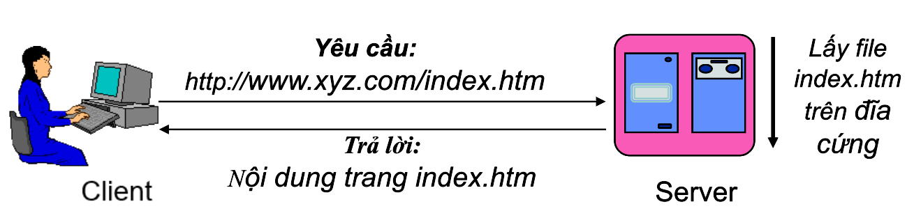
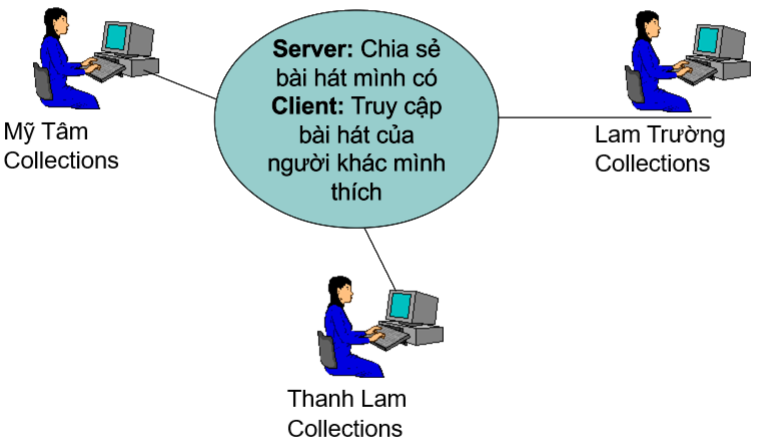
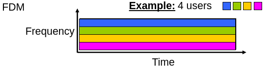
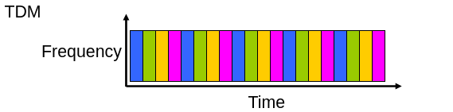

# Tổng quan về mạng máy tính
## Tổng quan

| Phân loại mạng | Đặc điểm / Mô tả |
| :--- | :--- |
| **Mạng điện báo** | Sử dụng mã Morse (2 tín hiệu tic te) để mã hóa dữ liệu truyền đi |
| **Mạng điện thoại** | - Cho phép thông tin dưới dạng âm thanh - Là mạng chuyển mạch (Circuit Switching) định hướng nối kết - Thiết lập nối kết tận biến giữa hai bên truyền nhận. |
| **Mạng hướng đầu cuối** | Mạng của Mainframe |
| **Mạng máy tính** | Mạng của hai hay nhiều máy tính được nối lại với nhau bằng đường truyền vật lý theo một kiến trúc nào đó |
## Mạng máy tính
- Mạng của hai hay nhiều máy tính được nối lại với nhau bằng đường truyền vật lý theo một kiến trúc nào đó.

## Cấu trúc mạng máy tính

Gồm 3 thành phần

- Rìa của mạng (_network edge_): Các “máy chủ/trạm làm việc” và các ứng dụng mạng
- Truy cập mạng (_physical media_): các kênh truyền tải thông tin hữu tuyến hoặc vô tuyến
- Lõi của mạng (_network core_): hệ thống các bộ chọn đường và kết nối tốc độ cao.

### **Rìa của mạng (network edge)**:

- Các “máy chủ/máy trạm” thực thi các ứng dụng mạng
- Các “máy chủ/máy trạm” còn được gọi là các End Systems (điểm khởi đầu và điểm kết thúc của các dòng thông tin)

- Tổ chức theo mô hình

  - Client-Server

  

  - Peer-to-Peer

  

### Truy cập mạng (Access Network)

Kết nối các máy tính (hosts - end system) vào các Router ngoài biên (Edge Router):

- Dial: đường điện thoại, ADSL, FTTH
- Mạng cục bộ (Ethernet LAN) của các tổ chức, doanh nghiệp, trường học,...
- Mạng không dây: WIFI, 4G, 5G...

#### Mạng đường trục (Network core)

- Mạng tốc độ cao của các router
- Đảm bảo thông tin thông suốt giữa các máy tính cách xa nhau
- Sử dụng hai chế độ truyền tin: mạng chuyển mạch & mạng chuyển gói

#### Mạng chuyển mạch

- Thiết lập kênh truyền tận hiến giữa hai bên truyền nhận
- Hai phương pháp thực hiện:
  - Phân chia theo tần số (FDMA - Frequency Division Multi Access)
    
  - Phân chia theo thời gian (TDMA - Time Division Multi Access)
    
  => Thiết lập mạch tận hiến, đảm bảo tốc độ nhưng phục vụ số lượng người hạn chế
#### Mạng chuyển gói (Packet Passing Network)

- Thông tin truyền đi được chia thành các gói tin (Packetts)
- Các gói tin của hosts khác nhau cùng chia sẻ tài nguyên mạng
- Mỗi gói tin sẽ sử dụng toàn bộ băng thông của liên kết khi nó được phép.
- Giải quyết nghẽn mạch → **Sử dụng kỹ thuật lưu và chuyển tiếp (store and forward)**
 =>Phục vụ nhiều người hơn nhưng không cham kết chất lượng dịch vụ (có thể mất gói hoặc trễ)

#### So sánh chuyển mạch vs chuyển gói

**Chuyển mạch**
- Một đường truyền 1Mbit
- Mỗi người dùng được cấp 100Kbps khi truy cập “active”
- Thời gian active chiếm 10% tổng thời gian.

Khi đó:
- Circuit-switching cho phép tối đa **10 users**
- Packet-switching cho phép 35 users, **xác suất có hơn 10 “active” đồng thời là nhỏ hơn 0.004**
  - Thích hợp cho lượng lưu thông dữ liệu lớn nhờ cơ chế chia sẻ tài nguyên và không cần thiết lập kết nối.
  - Cần có cơ chế điều khiển tát nghẽn và mất dữ liệu.
  - Khó đảm bảo băng thông cố định cho các ứng dụng đa phương tiện.
**Chuyển gói:**
- Thích hợp cho lượng lưu thông dữ liệu lớn nhờ cơ chế chia sẻ tài nguyên và không cần thiết lập kết nối.
- Cần có cơ chế điều khiển tắt nghẽn và mất dữ liệu.
- Khó đảm bảo băng thông cố định cho các ứng dụng đa phương tiện.

## Lợi ích của mạng

| **Tạo khả năng dùng chung**                            | phần cứng, phần mềm, dữ liệu.                                   |
| ------------------------------------------------------ | --------------------------------------------------------------- |
| **Nâng cao độ tin cậy của hệ thống**                   | công việc vẫn có thể tiếp tục khi có hư hỏng xảy ra.            |
| **Giúp nâng cao hiệu suất công việc**                  | giảm bớt một số công đoạn, tránh lặp lại công việc…             |
| **Giảm chi phí đầu tư**                                | dùng chung các thiết bị phần cứng, phần mềm đắt tiền.           |
| **Tăng cường tính bảo mật thông tin**                  | chương trình & dữ liệu được đặt trên các máy chủ.               |
| **Nhiều ứng dụng mới ra đời**                          | làm việc từ xa, làm việc nhóm, văn phòng ảo, hội thảo qua mạng. |
| **Sử dụng thay thế các dịch vụ liên lạc truyền thống** | IP telephone, email, IPTV, Chat…                                |

## Bài tập

Chúng ta phải mất thời gian bao lâu để gởi một tập tin có dung lượng **640,000** bits từ máy A tới máy B thông qua một mạng circuit-switched? Biết rằng:

- Tất cả các liên kiết (đường truyền) là **1.536 Mbps**
- Tất cả các liên kết đều sử dụng TDM với **24 slots/sec**
- **500 msec** để thiết lập một kết nối chuyển mạch giữ A và B

Đáp án $\displaystyle \frac{640000 \times 24}{1.536 \times 10^6} + 0.5 = 10.5$
