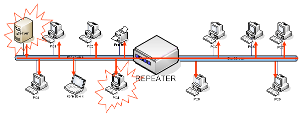

# Các thành phần của mạng máy tính

# Phân loại mạng

## Phân loại mạng theo kỹ thuật truyền tin

### Mạng quảng bá (Broadcast)

- Tất cả các máy tính trong mạng chia sẻ một kênh truyền
- Khi một máy tính gởi tin-> tất cả các máy tính còn lại đều nhận
- Tại một thời điểm chỉ có một máy được gởi

### **Mạng điểm nối điểm (Point to Point) - Mạng chuyển mạch (Switched Network) :**

- Có nhiều kết nối giữa các cặp máy tính 
- Thông tin được gửi từ nguồn đến đích có thể thông qua các điểm trung gian 
$\Rightarrow$ **Cần tìm đường đi nào đi tốt nhất cho gói tin**

## Phân loại mạng theo khoảng cách địa lí

| Đường kính mạng | Vị trí của các máy tính | Loại mạng |
| --- | --- | --- |
| 1 m | Trong một mét vuông | Mạng khu vực cá  nhân |
| 10 m | Trong 1 phòng | Mạng cục bộ, gọi tắt là mạng LAN (Local Area Network) |
| 100 m | Trong 1 tòa nhà |  |
| 1 km | Trong một khu vực | Mạng thành phố, gọi tắt là mạng MAN (Metropolitan Area Network) |
| 10 km | Trong một thành phố |  |
| 100 km | Trong một quốc gia |  |
| 1000 km | Trong một châu lục | Mạng diện rộng, gọi tắt là mạng WAN (Wide Area Network)  |
| 10000 km | Cả hành tinh |  |

### Mạng cục bộ (LAN-Local Area Network)

Thuộc loại mạng quảng bá

Sử dụng đường truyền băng thông rộng

Có hình trạng (topology) đơn giản như:

- Mạng tuyến tính (Bus)
    
    
    
    Tất cả các máy tính kết nối với nhau bằng một dây dẫn (cáp đồng trục)
    
    Ưu điểm: dễ cài đặt và chi phí xây dựng thấp.
    
    Khuyết điểm: Khó phát hiện lỗi.
    

- Mạng hình sao (Star)
    
    Các máy tính được nối vào một thiết bị tập trung (Hub/Switch) thông qua một liên kết riêng (cáp UTP/Cáp quang)
    
    **Ưu điểm:**
    
    - Dễ cài đặt, dễ phát hiện lỗi
    - Mạng vẫn hoạt động khi thêm hoặc bớt
    
    **Khuyết điểm:** 
    
    - Chi phí cao hơn so với Bus
    - Không hoạt động nếu Hub bị lỗi

- Mạng hình vòng (Ring)
    
    Truyền thông tin bằng cách sử dụng một thẻ (token) lần lượt truyền qua các máy tính
    
    - Ưu điểm: Không xảy ra đụng độ -> hiệu xuất 100%
    - Khuyết điểm: Chi phí cao, không hoạt động khi vòng bị gãy

### Mạng đô thị (MAN - Metropolitan Area Network)

Phạm vi:

- Một thành phố
- Một khu đô thị
- Một khu kinh

### Mạng diện rộng (WAN - Wide Area Network)

Ra đời nhằm đáp ứng:

- Tăng khoảng cách giữa các host trong mạng
- Tăng số lượng các host trong mạng

=>  Mở rộng mạng

*Sử dụng kỹ thuật Lưu và chuyển tiếp (Store and Forward)*

## Phân loại mạng hữu tuyến - vô tuyến

## Liên mạng (Internetwork)

Liên mạng hình thành từ việc nối kết nhiều mạng lại với nhau (có thể không đồng nhất về phần cứng và phần mềm)

- LAN = LAN + LAN
- WAN = LAN + LAN
- WAN = WAN + WAN

# Kiến trúc mạng

## Các thành phần phần mềm mạng

Là thành phần thật sự làm cho mạng máy tính hoạt động, được xây dựng dựa trên nền tảng của 03 khái niệm:

- **Giao thức (Protocol):** Mô tả cách thức hai thành phần mạng giao tiếp trao đổi thông tin với nhau.
- **Dịch vụ (Services):** Mô tả những gì mà một thành phần mạng cung cấp cho các thành phần khác muốn giao tiếp với nó.
- **Giao diện (Interfaces):** Mô tả cách mà một khách hàng có thể sử dụng được các dịch vụ mạng và cách các dịch vụ có thể được truy cập đến.

## Kiến trúc thứ bậc của giao thức

Để giảm độ phức tạp trong quá trình thiết kế và xây dựng, các hệ thống mạng được tổ chức thành một chồng (stack) các tầng (lớp) khác nhau, theo nguyên tắc:

- Tầng trên dựa vào tầng dưới (tầng trên sử dụng các **dịch vụ** của tầng dưới)
- Hai tầng ngang cấp nhau, trên 02 đối tượng mạng, luôn thống nhất với nhau về cách thức (**giao thức**) mà chúng sẽ trao đổi thông tin.

Giữa hai tầng liền kề tồn tại một **giao diện**

Các hệ thống mạng khác nhau sẽ có số tầng, tên các tầng, chức năng của từng tầng…khác nhau

### Bộ giao thức TCP/IP

## Dịch vụ mạng

Dịch vụ định hướng nối kết (Connection-oriented): 

- Vận hành theo mô hình của hệ thống điện thoại.
- Trước khi trao đổi thông tin 02 bên phải tiến hành thiết lập nối kết
- Sau khi trao đổi dữ liệu song 02 bên phải tiến hành ngắt kết nối.

Dịch vụ không nối kết (Connectionless): 

- Vận hành theo mô hình thư tín.
- Dữ liệu trước khi được truyền đi được vào trong những gói tin (Packets)
- Trên các gói tin có thông tin về địa chỉ người gởi và địa chỉ người nhận.

### Các phép toán của dịch vụ

Một dịch vụ mạng được mô tả bằng một tập các hàm cơ bản (tác vụ) sẵn có cho các khách hàng sử dụng

Một số hàm cơ bản thường có cho một dịch vụ định hướng kết nối như sau:

| Hàm cơ bản | Chức năng |
| --- | --- |
| LISTEN | Nghe để chờ một yêu cầu nối kết gởi đến |
| CONNECT | Yêu cầu thiết lập nối kết với bên muốn giao tiếp |
| RECIEVE | Chờ & nhận các thông điệp gởi đến |
| SEND | Gởi thông điệp sang bên kia |
| DISCONNECT | Kết thúc một nối kết |

## Sự khác biệt giữa Dịch vụ và Giao thức

Dịch vụ: là các thủ tục (phép toán) mà một tầng cung cấp cho tầng phía trên của nó.

Giao thức: Tập hợp các qui tắc mô tả khuôn dạng, ý nghĩa của các gói tin được trao đổi bởi hai thực thể.

Cùng một dịch vụ có thể được thực hiện bởi các giao thức khác nhau.
