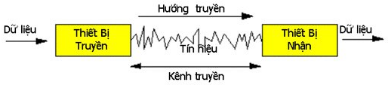

# Tầng vật lý

# Mô hình truyền dữ liệu cơ bản

Các vấn đề phải quan tâm:

- Cách thức mã hóa thông tin (dữ liệu) -> thành dữ liệu số.
- Các loại kênh truyền có thể sử dụng để truyền tin
- Sơ đồ nối kết các thiết bị truyền và nhận lại với nhau.
- Cách thức truyền tải các bits từ thiết bị truyền -> thiết bị nhận.

# Số hóa dữ liệu

## Vấn đề số hóa dữ liệu

| Loại thông tin | Hệ thống | Bộ mã hóa | Bộ giải mã | Truyền tải |
|---|---|---|---|---|
| **Âm thanh** | Điện thoại | Micro | Loa | Tín hiệu tuần tự hoặc tín hiệu số |
| **Ảnh tĩnh** | Fax | Scanner | Bộ thông dịch tập tin | Tín hiệu tuần tự hoặc tín hiệu số |
| **Dữ liệu tin học** | Mạng truyền tin | Bộ điều khiển truyền thông | Bộ điều khiển truyền thông | Tín hiệu tuần tự hoặc tín hiệu số |
| **Truyền hình** | Truyền hình quảng bá | Camera | Antenn + TV | Tín hiệu tuần tự hoặc tín hiệu số |

## Mô hình số hóa dữ liệu

- Trong thực tế dữ liệu được thể hiện dưới dạng đa phương tiện
- Mỗi loại dữ liệu được mã hóa theo các cách khác nhau -> kết quả cuối cùng: **một chuỗi các số 0 và 1**.
## Số hóa văn bản

- **Hệ thống mã hoá văn bản đầu tiên là mã Morse**

  - Là bộ mã nhị phân sử dụng 02 ký tự “.” và “\_” để mã hoá văn bản ít ký tự được mã hoá, sử dụng các chuỗi không đều nhau -> không được sử dụng để số hoá dữ liệu

   

  -  ASCII, ANSI, EBCDIC, Unicode: là các bộ mã được sử dụng hiện nay
- **Bảng mã ASCII** (American Standard Code for Informatics Interchange) chuẩn:
  - Sử dụng 7 bit để mã hoá thông tin (128 ký tự)
  - Ví dụ: ký tự “a” được mã là 1100001

  - Bảng mã ASCII mở rộng
    - Sử dụng 8 bit để mã hoá thông tin (256 ký tự)
    - Việc mở rộng không được thống nhất → khó trao đổi thông tin
    - Điển hình là ANSI (American Nation Standards Institute)

- **Mã EBCDIC** (Extended Binary-Coded Decimal Interchange Code): chỉ được sử dụng trong các hệ thống của IBM

- **Bảng mã Unicode 16-bit (UTF-16)**
  - **Ưu điểm**: cho phép 65536 ký tự; tương thích với bộ mã ASCII ở 128 ký tự đầu tiên (ASCII là tập con của Unicode)
  - **Khuyết điểm**: hầu hết các máy tính vẫn còn dùng bộ mã ASCII -> chỉ xử lý dữ liệu theo từng chuỗi 8-bit
  - Các máy tính sẽ lầm lẫn khi xử lý các kí tự Unicode được mã hóa dưới dạng 16-bit (UTF-16). 

  - Ví dụ: kí tự "a" dạng 16-bit sẽ được dịch thành HAI kí tự: kí tự thứ nhất là NUL (00000000), và kí tự thứ hai là kí tự ASCII "a" (01100001).

- **Bảng mã Unicode 8-bit (UTF-8)**
  - Một kí tự Unicode sẽ được mã hóa thành một hay nhiều chuỗi 8-bit để các hệ ASCII có thể nhận diện.
  - Ðể tương thích với ASCII, 128 kí tự Unicode thuộc bảng mã ASCII được mã hóa thành một chuỗi 8-bit tương đương với giá trị nhị phân của mã.
  - Các kí tự Unicode có mã lớn hơn được mã hoá thành HAI hoặc BA chuỗi 8-bit (byte)
  - Trong UTF-8, byte đầu tiên của một kí tự Unicode sẽ chỉ định có bao nhiêu byte đi kèm theo dành cho kí tự đó.

## Số hóa hình ảnh tĩnh

- Ảnh số: được xây dựng từ các đường thẳng và mỗi đường thẳng được xây dựng bằng các điểm
- Ví dụ: một ảnh theo chuẩn VGA với độ phân giải 640x480 có nghĩa là một ma trận với 480 đường ngang và mỗi đường ngang gồm 640 điểm ảnh

  

- Một điểm ảnh được mã hoá tuỳ theo chất lượng của ảnh:

  - Ảnh đen trắng: sử dụng 1 bit để mã hoá một điểm ảnh.
  - Ảnh 16 mức xám: sử dụng 4 bits / điểm ảnh
  - Ảnh 256 mức xám: sử dụng 8 bits / điểm ảnh
  - Ảnh màu: là sự phối hợp của 03 màu cơ bản Đỏ (Red), xanh lá (Green), xanh dương (Blue), do đó 1 điểm ảnh được biểu diễn bởi: `aR + bG +cB` → sử dụng 24 bit để mã hoá
    - Kích thước của ảnh màu thường lớn, vì thế chung ta cần có các phương nén kích thước của các ảnh: GIF, JPEG

## Số hóa âm thanh và phim ảnh

Dữ liệu âm thanh và phim ảnh thuộc kiểu tuần tự
1. **Lấy mẫu**: Với tần số f, ta đo biên độ của tín hiệu -> có được một loạt các số đo.
2. **Lượng hóa:** xác định một thang đo với giá trị là lũy thừa của 2 và thực hiện việc lấy tương ứng các số đo vào giá trị thanh đo 
3. **Số hóa:** Mỗi một giá trị sau đó được mã hóa thành các giá trị nhị phân và đặt vào trong các tập tin.

Dung lượng file nhận được phụ thuộc hoàn thoàn vào tần số lấy mẫu **f** và số lượng bit dùng để mã hóa giá trị thang đo **p** (chiều dài mã cho mẫu giá trị)

# Kênh truyền

## Kênh truyền hữu tuyến
- Sử dụng 3 loại cáp phổ biến:
  - Cáp đồng trục (coaxial)
  - Cáp xoắn đôi (twisted pair)
  - Cáp quang (fiber optic)

- Các yếu tố chọn lựa:
  - Giá thành
  - **Khoảng cách**
  - Số lượng máy tính
  - **Tốc độ yêu cầu (băng thông)**
### Cáp đồng trục
- **Cáp đồng trục béo (Thick Coaxial cable –RG8/U)**

  - Trở kháng 50 Ω
  - Dùng trong chuẩn **Ethernet 10-BASE5**
  - Dùng đầu nối AUI, BNC, T
  - Chiều dài tối đa **500 m**
  - Tốc độ tối đa **10Mbps**

- **Cáp đồng trục gầy (Thin Coaxial cable - RG58/U)**
  - Trở kháng 50 Ω
  - Dùng trong chuẩn Ethernet **10-BASE2******
  - Dùng đầu nối AUI, BNC, T
  - Chiều dài tối đa **185 m**
  - Tốc độ tối đa **10Mbps**

- Dùng trong mô hình mạng tuyến tính, chi phí rẻ -> hiện nay ít sử dụng

  

### Cáp xoắn đôi

- UTP (Unshielded Twisted Pair): được sử dụng trong hệ thống mạng hình sao
- Sử dụng đầu nối **RJ45**
- Chiều dài tối đa: **100m**
- Khả năng chống nhiễu kém, chỉ nên đi trong nhà

  
- Hiện nay được sử dụng phổ biết nhất trong mạng LAN
- Sử dụng trong các chuẩn Ethernet sau
  - 10 BASE-T: Dùng UTP Cat 3,5, tốc độ tối đa 10Mbps
  - 100 BASE-TX: Dùng UTP Cat 5 trở lên, tốc độ tối đa 100Mbps
  - 1000 BASE-T: Dùng UTP Cat 5e trở lên, tốc độ tối đa 1000Mbps

### Cáp quang
- Cáp quang: được sử dụng trong hệ thống mạng hình sao
- Sử dụng đầu nối: SC, ST, MJ-RJ, LC
- Chiều dài tối đa: lên đến hàng trăm Kilomet
- Không bị nhiễu, suy giảm thấp, băng thông lớn, khó thi công, dễ gãy.
- Được sử dụng trong mạng LAN để kết nối các toà nhà lại với nhau
- Sử dụng trong các chuẩn Ethernet sau:
  - 10 BASE-F: Multimode, Tốc độ tối đa 10Mbps
  - 100 BASE-FX: Multimode, Tốc độ tối đa 100Mbps
  - 1000 BASE-SX: Multimode, Tốc độ tối đa 1000Mbps (330 → 550m)
  - 1000 BASE-LH: Singlemode, Tốc độ tối đa 1000Mbps

1. **Cáp quang chế độ đơn:** Các tia sáng di chuyển bằng cách phản xạ giữa bề mặt của 2 môi trường có chiết suất khác nhau (n2>n1) -> tia sáng được tập trung nên truyền đi nhanh
2. **Chế độ đa không thẩm thấu:** Các tia sáng di chuyển bằng cách phản xạ giữa bề mặt của 2 môi trường có chiết suất khác nhau $n_2 > n_1$) → mất nhiều thời gian hơn để các sóng di chuyển so với chế độ đơn
3. **Chế độ đa thẩm thấu:** Chiết suất tăng dần từ trung tâm về vỏ của ống → sự phản xạ trong trường hợp này rất nhẹ nhàng

  

  

## Kênh truyền vô tuyến

- Đặc biệt hữu dụng ở những địa hình mà kênh truyền hữu tuyến không thể thực hiện được như: rừng rậm, đồi núi…

- Kênh truyền vô tuyến truyền tải thông tin ở tốc độ ánh sáng
  - $c$ là tốc độ ánh sáng
  - $f$ là tần số của tín hiệu sóng
  - $\lambda$ là độ dài sóng. Khi đó ta có: $c = \lambda f$
- Tín hiệu có tần số càng cao thì độ phát tán càng thấp, ví dụ:
  - Sóng điện thoại di động có tần số khoảng 900 Hz
  - Sóng Wi-Fi chuẩn b và g khoảng 2.4Ghz, chuẩn A khoảng 5Ghz
  

## Tín hiệu tuần tự & Tín hiệu số

- Dữ liệu (các bits 0, 1) được truyền từ thiết bị truyền sang thiết bị nhận bằng các tín hiệu tuần tự hay tín hiệu số
  - Tín hiệu tuần tự
    
  - Tín hiệu số
    
## Tín hiệu dạng sóng hình sin

Sóng dạng hình sin:

- Là dạng tín hiệu tuần tự đơn giản nhất (không kết thúc hoặc suy giảm sau một khoảng thời gian)
- Dễ dàng tạo ra được.

Một nghiên cứu cụ thể đã chỉ ra

> **Bất kỳ một dạng tín hiệu nào cũng có thể được biểu diễn lại bằng các sóng hình sin**

## Đặc điểm kênh truyền

Mô hình hóa một kênh truyền

$v_{in}(t) = V_{in} sin wt$

- $V_{in}$: là hiệu điện thế cực đại ngỏ vào
- $w$: nhịp; $f = \dfrac{w}{2\pi}$: là tần số;
- $T = \dfrac{w}{2\pi} = \dfrac{1}{f }$: là chu kỳ.

$v_{out}(t) = V_{out}sin(wt + F)$

- $V_{out}$: là hiệu điện thế cực đại ngỏ ra
- $F$: là độ trễ pha.

Các luật trường điện từ chứng minh rằng trong trường hợp đơn giản nhất ta có:

- $\dfrac{V_{out}}{V_{in}} = (1 + R^2C^2w^2)^{-\frac{1}{2}}$
- $F = arctan(-RC w)$

Độ suy giảm trên kênh truyền = Pin/Pout

Biểu diễn bằng đơn vị decibel:

- $A(w) = 10 log_{10}(\dfrac{P_{in}}{P_{out}})$

Độ suy giảm càng nhỏ khi tần số của sóng càng gần $f_0$ **(tần số lý tưởng)**

## Truyền tín hiệu bất kỳ

Theo lý thuyết Fourrier bất kỳ một tín hiện nào cũng có thể xem như được tạo thành từ một số hữu hạn hoặc vô hạn các sóng hình Sin. Chúng ta có kết quả sau:

- Một tín hiệu bất kỳ x(t) thì có thể phân tích thành một tập hợp các tín hiệu dạng sóng hình sin.
- Nếu là tín hiệu tuần hoàn, thì ta có thể phân tích nó thành dạng một chuỗi Fourier (một loạt các sóng hình sin có tần số khác nhau như là các bội số của tần số tối ưu $f_0$)
- Nếu tín hiệu không là dạng tuần hoàn, thì ta có thể phân tích nó dưới dạng một bộ Fourier, với các sóng hình sin có tần số rời rạc.

## Băng thông kênh truyền (Bandwidth)

$A_0$: ngưỡng còn “nghe” được

- Tất cả các tín hiệu hình sin có tần số nhỏ hơn f1 được xem như bị mất.
- Tất cả các tín hiệu có tần số lớn hơn f2 cũng được xem là bị mất.
- Những tín hiện có thể nhận ra được ở bên nghe là các tín hiệu có tần số nằm giữa f1 và f2. Khoảng tần số này được gọi là băng thông của một kênh truyền.
- Băng thông càng lớn càng có nhiều tín hiệu được truyền đến nơi nhận.

Ví dụ: Băng thông kênh truyền điện thoại là 3100 Hz vì các tín hiệu âm thanh có thể nghe được nằm ở khoảng tần số từ 300 Hz đến 3400 Hz

## Tần số biến điệu và tốc độ dữ liệu (Baund rate and bit rate)

Tần số biến điệu:

- Nhịp đặt các tín hiệu lên kênh truyền
- $R = \dfrac{1}{t}$ ( đơn vị là bauds),
- $t$: độ dài thời gian của tín hiệu

Mỗi tín hiện chuyển tải n bit, khi đó ta có tốc độ bit được tính như sau:

- $D = nR$ (đơn vị là bits/s)
- Giá trị này thể hiện **nhịp mà ta đưa các bit lên đường truyền**

Ví dụ : Cho hệ thống có

- R = 1200 bauds và D = 1200 bits/s.
- Ta suy ra một tín hiện cơ bản chỉ chuyển tải một bit.

## Tăng tốc độ truyền dữ liệu

Vì $D = n R$

Để tăng $D$:

- Hoặc tăng $n$ (số bit truyền tải bởi một tín hiệu), tuy nhiên nhiễu là một rào cản quan trọng.
- Hoặc $R$( tần số biến điệu), tuy nhiên chúng ta cũng không thể vượt qua tần số biến điệu cực đại Rmax

Nyquist (1928): mối quan hệ giữa tần số biến điệu R và băng thông của kênh truyền W

- Lý thuyết: $R_{max}$ = 2 W
- Thực tế thì $R_{max}$ = 1,25 W

## Nhiễu và khả năng kênh truyền

Có 3 loại nhiễu

- Nhiễu xác định: phụ thuộc vào đặc tính của kênh truyền
- Nhiễu không xác định
- Nhiễu trắng từ sự chuyển động của các điện tử

Nhiễu làm cho bên nhận khó xác định được bit 0 hay bit 1⇒ Công xuất tín hiệu nên lớn hơn nhiều công xuất của nhiễu

Tỷ lệ giữa công suất tín hiệu và công suất nhiễu tính theo đơn vị décibels:

$\dfrac{S}{B} = 10log_{10}\dfrac{P_S(Watt)}{P_B(Watt)}$

Định lý Shannon (1948) xác định số bit tối đa có thể chuyên chở bởi một tín hiệu:

$n_{max} = log_2\sqrt{1 + \dfrac{P_S}{P_B}}$

Kết hợp giữa Nyquist và Shannon:

$$
C = D_{max} = R_{max}n_{max} = 2Wlog_2\sqrt{1 + \dfrac{P_S}{P_B}} = Wlog_2[1 + \dfrac{P_S}{P_B}]
$$

Khả năng của kênh truyền C, xác định tốc độ bit tối đa có thể chấp nhận được bởi kênh truyền đó

Ví dụ : Kênh truyền điện thoại có

- Độ rộng băng thông là $W = 3100 Hz$
- Tỷ lệ $\dfrac{S}{B} = 20dB$.
- Hãy tính khả năng của kênh truyền điện thoại C = ?

Ta có:

$C = D_{max} = R_{max}n_{max} = 2Wlog_2\sqrt{1 + \dfrac{P_S}{P_B}} = Wlog_2[1 + \dfrac{P_S}{P_B}]$

Từ $\dfrac{S}{B} = 10log_{10}\dfrac{P_S(Watt)}{P_B(Watt)}$

⇒ $\dfrac{P_S}{P_B} = 10^\frac{P_S(Watt)}{10P_B(Watt)}= 10^\frac{20}{10} = 10^2$

⇒ $C = W log_2(1+\dfrac{P_S}{P_B}) =  3100 * log_2(1+100) = 20600 b/s$

## Lưu lượng/Giao thông (Traffic)

- Lưu lượng là đại lượng chỉ mức độ sử dụng kênh truyền → xác định kênh truyền phù hợp với mức độ sử dụng hiện tại.

- Để đo mức độ sử dụng kênh truyền trong một giây ta sử dụng biểu thức sau :

$$ \boxed{E = T\dfrac{Nc}{3600}} $$

- Trong đó
  - $E$: mức độ sử dụng kênh truyền trong một giây
  - $T$: độ dài trung bình của một phiên giao dịch (session), đơn vị là giây
  - $N_c$: Số lượng phiên giao dịch trung bình trong một giờ

- Trong thực tế một phiên giao dịch chứa nhiều khoản im lặng (không dùng kênh truyền) ⇒ có hai loại phiên giao dịch

  - Các phiên giao dịch ở đó T được sử dụng hết (1)
  - Các phiên giao dịch ở đó T không được sử dụng hết (2)

- Trường hợp (2) lưu lượng **không phản ánh** đúng mức độ bận rộn của kênh truyền

- Ta chia Phiên giao dịch thành nhiều Giao dịch (transaction) với độ dài trung bình là p bit, chúng cách nhau bởi những khoảng im lặng.

- Giả sử Nt là số giao dịch trung bình trong một phiên giao dịch.

  

- Gọi D là tốc độ bit của kênh truyền, tốc độ bit thật sự d trong trường hợp này là: $d = \dfrac{N_1P}{T}$

- Tầng suất sử dụng kênh truyền được định nghĩa bởi tỷ số: $\theta = \dfrac{d}{D}$

- Ví dụ: Trong một giao tiếp giữ người dùng với máy tính trung tâm, người ta tính toán được :

- $p = 900 bits, N_t = 200, T = 2700 s, N_c = 0.8, D = 1200 b/s.$

Khi đó
- Mật độ giao thông trung bình là $E = (2700*0.8)/3600=0.6$
- Tốc độ bit thật sự trong phiên giao dịch là $d= (200*900)/2700 = 67$
- Tầng suất sử dụng kênh truyền $\theta = (67/1200) =0.06$

# Mã hóa đường truyền (Line Coding)

## Khái niệm

Sau khi số hóa thông tin, vấn đề chúng ta phải quan tâm kế tiếp là c**ách truyền tải các bit “0” và “1”** trên các kênh truyền → mã hóa đường truyền (line coding)

Có 02 phương pháp mã hoá đường truyền: **sử dụng tín hiệu số** hoặc **tín hiệu tuần tự** để truyền tải các bit “0”, “1”.

### Mã hóa đường truyền bằng tín hiệu số

a) NRZ : Điện thế mức 0 để thể hiện bit 0 và điện thế khác không V0 cho bit "1“

b) RZ : Mỗi bit "1" được thể hiện bằng một chuyển đổi điện thế từ V0 về 0.

c) Lưỡng cực NRZ : Các bit "1" được mã hóa bằng một điện thế dương, sau đó đến một điện thế âm và tiếp tục như thế.

d) Lưỡng cực RZ : Mỗi bit “1” được thể hiện bằng một chuyển đổi từ điện thế khác không về điện thế không. Giá trị của điện thế khác không đầu tiên là dương sau đó là âm và tiếp tục chuyển đổi qua lại như thế

#### Mã hóa hai pha (biphase):

a) **Mã hai pha thống nhất** đôi khi còn gọi là mã Manchester : bit "0" được thể hiện bởi một chuyển đổi từ tín hiệu dương về tín hiệu âm và ngược lại một bit “1” được thể hiện bằng một chuyển đổi từ tín hiệu âm về tín hiệu dương (**sử dụng trong chuẩn Ethernet**).

b) **Mã hai pha khác biệt :** bit 0 chuyển mức ở đầu bit, bit 1 không chuyển mức ở đầu bit.

### Mã hóa đường truyền bằng tín hiệu tuần tự
a) Sử dụng tín hiệu số theo mã NRZ
b) Sử dụng biến điệu biên độ
c) Sử dụng biến điệu tần số
d) Sử dụng biến điệu pha
e) Sử dụng biến điệu pha lưỡng cực (nhảy 1 pha ∏ đầu bit 1)

