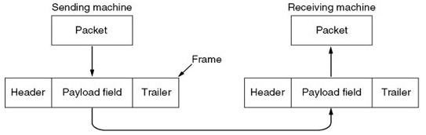
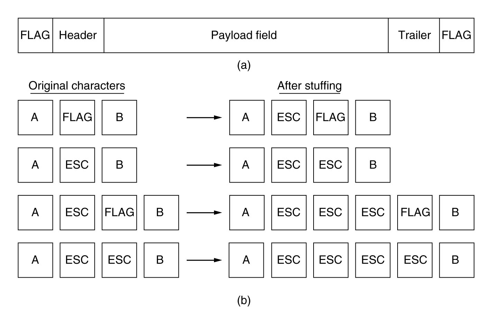

# Tầng liên kết dữ liệu

# Chức năng

- Cung cấp một giao diện dịch vụ chuẩn cho tầng mạng.
- Định khung
- Xử lý lỗi trong quá trình truyền dữ liệu.
- Điều chỉnh luồng dữ liệu

Để thực hiện -> đóng gói các gói tin (Packet) nhận được từ tầng mạng vào các khung (frame) để truyền đi.

## Các dịch vụ cơ bản

- **Dịch vụ không nối kết**
  - **không báo nhận (unacknowledged connectionless service)** thường được sử dụng trong mạng LAN.
  - **có báo nhận (acknowledged connectionless service)** thường dùng cho mạng không dây.
- **Dịch vụ nối kết định hướng có báo nhận (acknowledged connection-oriented service):** thường dùng trong mạng WANs.

## Định khung của tầng liên kết dữ liệu

- Qui định khuôn dạng của khung được sử dụng ở tầng Liên kết dữ liệu

- 3 phương pháp định khung phổ biến:
  - Đếm ký tự (Charater count)
  - Sử dụng các bytes làm cờ hiệu và các bytes độn (Flag byte with byte stuffing)
  - Sử dụng cờ bắt đầu và kết thúc khung cùng với các bit độn (Starting and ending flags with bit stuffing)

### Phương pháp đếm ký tự (Character Count)

Nếu một khung nào đó bị sai -> không xác định được các khung tiếp theo sau

### Phương pháp sử dụng byte làm cờ và các byte động (Flag byte with byte stuffing)

(a) Khung được đánh dấu bởi cờ hiệu,

(b) Dữ liệu có chứa cờ hiệu và byte ESC.

### Phương pháp sử dụng cờ bắt đầu & kết thúc khung cùng với các bit độn

Sử dụng mẫu bit đặc biệt, 01111110, để làm cờ đánh dấu điểm bắt đầu và kết thúc khung

(a) Dữ liệu gốc

(b) Dữ liệu chuyển lên đường truyền

(c) Dữ liệu nhận sau khi loại bỏ các bit độn.

## Điều khiển lỗi (Error Control)

- Người nhận báo về tình trạng nhận khung  → Sử dụng Khung báo nhận (acknowledgement)

- Tránh chờ vĩnh viễn   → Sử dụng bộ đếm thời gian (timer) + timeout

- Trùng lắp gói tin nhận → Gán số thứ tự cho khung

## Điều khiển luồng (Flow Control)

- Giải quyết sự khác biệt về tốc độ truyền / nhận dữ liệu của bên truyền và bên nhận

- Hai tiếp cận:
  - Tiếp cận điều khiển luồng dựa trên phản hồi (feedback based flow control): Người nhận gởi thông tin về cho người gởi cho phép người gởi gởi thêm dữ liệu, cũng như báo với người gởi những gì mà người nhận đang làm.
  - Tiếp cận điều khiển luồng dựa trên tần số (rate based flow control): Trong giao thức truyền tin cài sẵn cơ chế giới hạn tần suất mà người gởi có thể truyền tin.

# Vấn đề xử lý lỗi

## Lỗi trên đường truyền

- Khi truyền tải lỗi có thể phát sinh dẫn tới: bit 1 thành bit 0 và ngược lại

- Tỷ lệ lỗi
  - $\tau$= Số bít bị lỗi / Tổng số bít được truyền
  - $\tau$ : trong khoảng 10-5 đến 10-8
  - 88% : sai lệch một bit
  - 10% : sai lệch 2 bit kề nhau

## Bộ mã phát hiện lỗi

- Bên cạnh các thông tin hữu ích cần truyền đi, ta thêm vào các thông tin điều khiển.
- Bên nhận thực hiện việc giải mã các thông tin điều khiển này để phân tích xem thông tin nhận được là chính xác hay có lỗi

  

**Bộ mã sửa lỗi (Error-correcting codes):**

- Cho phép bên nhận có thể tính toán và suy ra được các thông tin bị lỗi (sửa dữ liệu bị lỗi)

**Bộ mã phát hiện lỗi (Error-detecting codes):**

- Cho phép bên nhận phát hiện ra dữ liệu có lỗi hay không
- Nếu có lỗi bên nhận sẽ yêu cầu bên gởi gởi lại thông tin
    
  Các hệ thống mạng ngày nay có xu hướng chọn bộ mã phát hiện lỗi.

## Phương pháp kiểm tra chẵn lẻ

- Với chuỗi bits dữ liệu cần truyền xxxxxxx, ta thêm vào 1 bit chẵn - lẽ p
    → chuỗi bit truyền là: xxxxxxxp
- p được tính để đảm bảo:
  - Phương pháp kiểm tra chẵn: xxxxxxxp có một số chẵn các bit 1
  - Phương pháp kiểm tra lẻ: xxxxxxxp có một số lẻ các bit 1

## Kiểm tra thêm theo chiều dọc (Longitudinal Redundancy Check or Checksum)

- Để cải tiến phương pháp kiểm tra chẵn lẻ, phương pháp LRC xem các khung như một khối nhiều ký tự được xắp xếp theo dạng 02 chiều
- Việc kiểm tra chẵn lẻ sẽ được thực hiện cả theo chiều ngang và chiều dọc
- Phương pháp này giảm tỷ lệ lỗi từ 2 đến 4 lần so với phương pháp chẵn lẻ.

  

## Kiểm tra phần dư tuần hoàn (Cyclic Redundancy Check – CRC)

### Nguyên tắc tạo mã CRC

- Xét khung dữ liệu gồm _k bit_ và nếu ta dùng _r bit_ cho khung kiểm tra **FCS (Frame check sequence)** thì khung thông tin kể cả dữ liệu kiểm tra gồm _(k+r) bit_ sao cho nó chia đúng cho một số P có _(r+1) bit_ chọn trước.

- Ở máy nhận khi nhận được khung dữ liệu, lại mang chia cho số P này và nếu phép chia là chia hết thì khung dữ liệu không chứa lỗi.

### **Xác định mã CRC dùng thuật toán Mod-2**

- Giả sử ta có:
  - M = 1010001101 (10 bit)

  - P = 110101 (6 bit)

- FCS cần phải tính toán ( 5 bit)
- Lần lượt thực hiện các bước sau:

- Tính M\*25 = 101000110100000.

- Thực hiện phép chia modulo M\*25 cho P ta được phần dư F = 01110

- Tạo khung gởi đi là $T = M\times2^r + F$ = 101000110101110

### **Xác định mã CRC dùng phương pháp đa thức**

- Giả sử ta có M=110011và P = 11001, khi đó M và P được biểu diễn lại bằng 2 đa thức sau:
  - $M(x) = x^5 + x^4 + x + 1$

  - $P(x) = x^4 + x^3 + 1$

- Quá trình tính CRC được mô tả dưới dạng các biểu thức sau:

  $$
  \frac{x^nM(x)}{P(x)} = Q(x) + \frac{R(x)}{P(x)}\\T(x) = x^nM(x) + R(x)
  $$

Các version thường được sử dụng của P là:

$$
\begin{align*}
\text{CRC-12} &= x^{12} + x^{11} + x^{3} + x^{2} + x + 1\\
\text{CRC-16} &= x^{16} + x^{15} +  x^{2} + x + 1\\
\text{CRC-CCITT} &= x^{16} + x^{12} + x^{5} + 1\\
\text{CRC-12} &= x^{32} + x^{26} + x^{23} + x^{22} + x^{16} + x^{12} + x{11} + x^{10} + x^{8} + x^{7} + x^5 + x^4 + x^2 + x + 1\\
\end{align*}
$$

# Các giao thức điều khiển lỗi (Error Control)

## Điều khiển lỗi

## Giao thức truyền đơn công không ràng buộc (Unrestricted Simplex Protocol)

- Truyền tải thông tin theo một chiều

- Kênh truyền không có lỗi

- Bên nhận có thể xử lý tất cả các thông tin gởi đến

- Bên truyền thực hiện việc truyền tải với tốc độ nhanh nhất có thể

## Giao thức truyền đơn công dừng và chờ (Simplex Stop & Wait Protocol)

- Truyền tải thông tin theo một chiều
- Kênh truyền không có lỗi
- Bên nhận chỉ có một vùng lưu trữ có khả hạn chế và xử lý chậm
  ⇒ giao thức được thiết kế cho trường hợp máy gởi nhanh làm tắc nghẽn máy nhận chậm

  

## Giao thức truyền đơn công cho kênh truyền có nhiễu (Simplex Protocol for Noisy Channel)

Thông thường các kênh truyền đều có lỗi, với kỹ thuật phát hiện lỗi → bên nhận sẽ phát hiện được lỗi. Tuy nhiên nếu khung bị mất:

- Người gởi không biết được khung có đến nơi nhận hay không
  - Giải pháp: Khung báo nhận.
  - Các khung báo nhận có thể bị mất
    - Giải pháp: Timer, Time-out, Gởi lại
- Bên nhận không phân biệt được các khung trùng lắp do bên gởi gởi lại
  - Giải pháp: Mỗi khung sẽ có một số thứ tự

## Cửa sổ trượt (Sliding Windows)

- Cửa sổ gồm có cửa trước và cửa sau cùng di chuyển theo một chiều.

- Kích thước của cửa sổ là chiều của cung giới hạn từ cửa sau đến cửa trước (phần tô đen).

- Kích thước của cửa sổ có thể thay đổi:
  - Khi cửa trước di chuyển, cửa sổ được mở rộng ra.
  - Khi cửa sau di chuyển, kích thước của cửa sổ bị thu hẹp lại và nó làm cho cửa sổ thay đổi vị trí, (trượt/quay quanh một tâm)

- Kích thước nhỏ nhất của cửa số là 0

- Giả sử ta có $n=2^k$ vị trí cho các cửa sổ → kích thước tối đa của cửa sổ là $n-1$ (Không n, để phân biệt với 0)

- K bit để đánh số thứ tự khung $0 \rightarrow (2^k-1)$

- Khi đó cửa sổ trượt sẽ được chia thành $2^k$ vị trí tương ứng với $2^k$ khung.

- Đối với cửa sổ gởi, **các vị trí nằm trong cửa sổ trượt biểu hiện số thứ tự của các khung mà bên gởi đang chờ bên nhận báo nhận**.
  - Phần bên ngoài cửa sổ là các khung có thể gởi tiếp.
  - Cửa sổ gởi không được vượt quá kích thước tối đa

- Đối với bên nhận, các vị trí nằm trong cửa sổ biểu hiện **số thứ tự các khung mà nó đang sẵn sàng chờ nhận.**
  - Kích thước tối đa của cửa sổ biểu thị dung lượng bộ nhớ đệm của bên nhận có thể lưu tạm thời các gói tin nhận được trước khi xử lý chúng.
  - Giả sử bên nhận có một vùng bộ nhớ đệm có khả năng lưu trữ 4 khung nhận được. Khi đó, kích thước tối đa của cửa sổ sẽ là 4

**Lưu ý:**

- Kích thước tối đa của của sổ nhận bằng **một nửa** khoảng đánh số thứ tự của khung.
- Số lượng buffer chỉ cần bằng kích thước tối đa của cửa sổ nhận, không cần thiết phải bằng số lượng khung.

## Vấn đề điều khiển lỗi

- Truyền lại tất cả các khung bắt đầu từ khung bị lỗi: 

→ giao thức Go-Back-N

- Khung bị lỗi bị loại bỏ, những khung tiếp sau vẫn được nhận và được lưu tạm trong vùng đệm, khi tới thời gian time-out bên gởi chỉ gởi lại khung bị mất: 

→ Selective Repeat

## **Thời điểm gởi báo nhận**

- Piggy-back: Gởi báo nhận vào khung dữ liệu của bên nhận

- Nếu bên nhận không còn dữ liệu để gởi đi
  - Mỗi lần có khung đến khởi động một Timer
  - Khi Timer đếm đến giá trị Time-out mà bên nhận không có dữ liệu để gởi ⇒ Gởi một khung báo nhận riêng

# Giao thức HDLC (High Level Data Link Control)

- Được sử dụng rất rộng rãi.

- Là cơ sở cho nhiều giao thức điều khiển liên kết dữ liệu.

- HDLC định nghĩa:
  - 03 loại máy trạm.
  - 02 cấu hình đường kết nối.
  - 03 chế độ điều khiển truyền tải.

## Các loại trạm (HDLC Station Types)

### Primary station

- Điều khiển các thao tác về đường truyền.
- Các khung gởi đi được gọi là các lệnh.
- Duy trì nhiều nối kết luận lý đến các secondary station.

### Secondary station

- Chịu sự điều khiển của primary station
- Các khung gởi đi được gói là các trả lời

### Combined station

- Có đặc tính của cả Primary station và Secondary station
- Có thể gởi đi các lệnh và các trả lời

## Các cấu hình đường nối kết (HDLC Link Configurations)

### Không cân bằng (Unbalanced)

- Gồm một Primary station và nhiều secondary stations
- Hỗ trợ 02 chế độ full duplex và half duplex

### Cân bằng (Balanced)

- Gồm hai Combined stations
- Hỗ trợ 02 chế độ full duplex và half duplex

## Các chế độ truyền tải (HDLC Transfer Modes )

### Chế độ trả lời bình thường - Normal Response Mode (NRM)

- Sử dụng với cấu hình kết nối không cân bằng
- Primary khởi động cuộc truyền tải tới secondary
- Secondary chỉ có thể truyền dữ liệu dưới dạng các trả lời cho các yêu cầu của primary
- Đòi hỏi nhiều đường dây để nối máy chính (Máy tính) với phụ (Terminal)

### Chế độ cân bằng bất đồng bộ - Asynchronous Balanced Mode (ABM)

- Được sử dụng với cấu hình kết nối cân bằng
- Cả 02 máy đều có thể khởi động một cuộc truyền tải dữ liệu mà không cần có phép của máy kia.
- Được sử dụng rộng rãi nhất trong 03 chế độ truyền tải

### Chế độ trả lời bất đồng bộ -Asynchronous Response Mode (ARM)

- Được sử dụng với cấu hình kết nối không cân bằng
- Secondary có thể khởi động một cuộc truyền tải mà không cần sự cho phép của primary.
- Primary vẫn đảm bảo vai trò về duy trì đường truyền (khởi động, phục hồi lỗi, xoá kết nối).
- **Ít được dùng.**

## Cấu trúc khung

- Tất cả các bit dữ liệu truyền đi được gói vào trong các khung

- Sử dụng một dạng khung cho tất cả các loại dữ liệu cũng như điều khiển
  - **Flag (8 bit) có giá trị:** 01111110 , sử dụng kỹ thuật bit độn
  - **Address (8 bit):** vùng địa chỉ, xác định địa chỉ máy đích.
  - **Control (8bit):** để xác định kiểu của khung
    - Thông tin (Information - I): Khung chứa dữ liệu được truyền đi, đồng thời chứa thông tin báo nhận (piggy-back)
    - Điều khiển (Supervisory - S): Khung báo nhận khi không còn dữ liệu để gởi ngược lại
    - Không đánh số (Unnumbered - U): Dùng để điều khiển nối kết
  - **Data (128-1024 bytes):** dữ liệu truyền
  - **FCS (Frame Check Sequence- 16 bit):**
    $\text{CRC-CCITT} = X^{16} + X^{12} + X^5 +1$

    

### Trường control

### Poll/Final bit

Nếu là khung lệnh (máy chính mời máy phụ truyền tin):

- Bit được đặt giá trị lên 1 có ý nghĩa là Poll (chọn).

Ngược lại, nếu là khung trả lời (thông tin được truyền từ máy phụ lên máy chính):

- Bit được đặt giá trị xuống 0, khi máy phụ còn dữ liệu gởi đi
- Bit được đặt giá trị lên 1, khi máy phụ không còn dữ liệu gởi đi, 1 biểu thị kết thúc việc gởi.

### Supervisory function bits (S)

| 00  | RR (Receive Ready)      | Là khung báo nhận, thông báo sẵn sàng nhận dữ liệu, đã nhận tốt đến khung Next-1, và đang đợi nhận khung Next. Được dùng đến khi không còn dữ liệu gởi từ chiều ngược lại để làm báo nhận (figgyback) |
| --- | ----------------------- | ----------------------------------------------------------------------------------------------------------------------------------------------------------------------------------------------------- |
| 01  | REJ (Reject)            | Đây là một khung báo không nhận (negative acknowledge), yêu cầu gởi lại các khung, từ khung Next.                                                                                                     |
| 10  | RNR (Receive Not Ready) | Thông báo không sẵn sàng nhận tin, đã nhận đến đến khung thứ Next-1, chưa sẵn sàng nhận khung Next                                                                                                    |
| 11  | SREJ (Selective Reject) | Yêu cầu gởi lại một khung có số thứ tự là Next                                                                                                                                                        |

### Unumbered function bits (M)

| 1111P100 | Lệnh này dùng để thiết lập chế độ truyền tải SABM (Set Asynchronous Balanced Mode).                                                  |
| -------- | ------------------------------------------------------------------------------------------------------------------------------------ |
| 1100P001 | Lệnh này dùng để thiết lập chế độ truyền tải SNRM (Set Normal Response Mode).                                                        |
| 1111P000 | Lệnh này dùng để thiết lập chế độ truyền tải SARM (Set Asynchronous Response Mode).                                                  |
| 1100P010 | Lệnh này để yêu cầu xóa nối kết DISC (Disconnect).                                                                                   |
| 1100F110 | UA (Unumbered Acknowledgment). Được dùng bởi các trạm phụ để báo với trạm chính rằng nó đã nhận và chấp nhận các lệnh loại U ở trên. |
| 1100F001 | CMDR/FRMR (Command Reject/Frame Reject). Được dùng bởi trạm phụ để báo rằng nó không chấp nhận một lệnh mà nó đã nhận chính xác.     |

# Giao thức điểm nối điểm (Point-to-Point Protocol)

- Sử dụng để truyền tải thông tin giữa các router trên mạng, hay giữa các máy tính người dùng với mạng của nhà cung cấp dịch vụ Internet (ISP)

- Được định nghĩa trong các RFC 1661, 1662, 1663.

- Hỗ trợ nhiều giao thức mạng vận hành trên nó, hỗ trợ chứng thực …

- PPP cung cấp 03 đặc tính:
  - Một phương pháp định khung cùng với phát hiện lỗi
  - Một giao thức điều khiển đường truyền ( Link Control Protocol LCP): thiết lập giao tiếp, kiểm tra kênh, thoả thuận các thông số, xoá kênh
  - Một giao thức thương lượng về các tùy chọn tầng mạng NCP (Network Control Protocol): thương lượng các tuỳ chọn tầng mạng dựa vào giao thức của tầng mạng được sử dụng

- Xét trường hợp quay số kết nối máy tính đến Router của ISP:
  1. Máy tính quay số đến Router của ISP thông qua modem, khi Router tiếp nhận cuộc gọi -> một kết nối vật lý được hình thành
  2. Máy tính sẽ gởi các gói LCP để thoả thuận các thông số PPP
  3. Tiếp theo các gói tin của giao thức NCP được gởi đi để cấu hình tầng mạng (ví dụ: gán địa chỉ IP)
  4. Khi người dùng kết thúc, NCP xoá kết nối tầng mạng, giải phòng IP, tiếp theo giao thức LCD sẽ xoá kết nối của tầng liên kết dữ liệu, cuối cúng máy tính sẽ yêu cầu modem kết thúc cuộc gọi

- Khung trong PPP tương tự như khung HDLC
  - Flag (8 bit) có giá trị: 01111110 , sử dụng kỹ thuật độn byte
  - Address (8 bit): vùng địa chỉ, xác định địa chỉ máy đích (giá trị 1111111 đại điện cho tất cả các máy trạm)
  - Control (8bit): có giá trị 0000011, biểu thị giao thức không sự dụng cơ chế báo nhận số thứ tự khung.
  - Trường protocol (1 hoặc 2 byte): Xác định phần chứa trong data được định nghĩa bởi giao thức mạng nào (IP, SPX…)
  - Data: dữ liệu truyền, chiều dài tối đa là 1500 bytes, LCP có thể thay đổi
