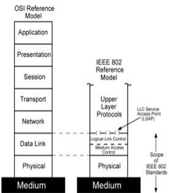
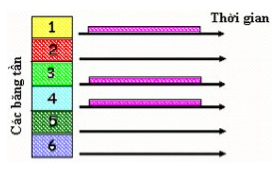
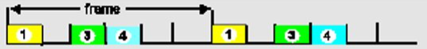
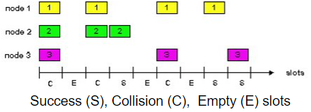
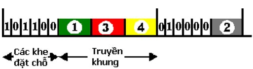
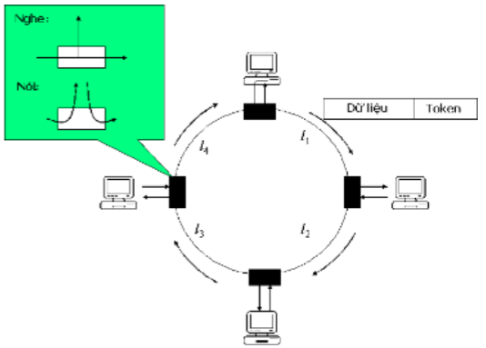
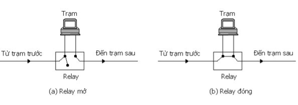
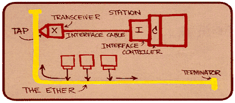

# Mạng cục bộ & lớp con điều khiển truy cập

# Giới thiệu

Phân loại mạng theo khoảng cách địa lý:

- Mạng cục bộ - Local Area Network (LAN)
- Mạng đô thị - Metropolitan Area Network (MAN)
- Mạng diện rộng - Wide Area Network (WAN)

Trong thực tế mạng LAN và WAN thường được cài đặt nhất, đặc biệt là mạng LAN

Chuẩn chung cho mạng LAN là IEEE 802.X; được sử dụng nhiều nhất là Ethernet (802.3), Wireless LAN (802.11), Token Ring (802.5).

_IEEE : Institute of Electrical and Electronics Engineers_

## Đặc tính

- Tất cả các host trong mạng LAN cùng chia sẻ đường truyền chung.
- Hoạt động dựa trên kiểu quảng bá (Broadcast).
- Không yêu cầu phải có hệ thống trung chuyển (routing/switching) trong một LAN đơn.

## Thông số

- Hình trạng (topology): xác định topology kết nối của các host trong một mạng LAN
- Đường truyền chung (Shared channel): xác định loại kênh được sử dụng để kết nối các host trong mạng LAN (xoắn đôi, đồng trục, cáp quang)
- Kỹ thuật truy cập đường truyền (Medium Access Control - MAC): xác định cách thức/phương pháp mà các host sử dụng để chia sẻ một kênh chung trong mạng LAN
- MAC quản lý việc truy cập đến đường truyền trong LAN và cung cấp cơ sở cho việc định danh các tính chất của mạng LAN theo chuẩn IEEE.

# MAC sublayer

## Kênh truyền đa truy cập (Multiple Access Links)

Có 3 loại kênh truyền:

- Point – to – point (single wire, e.g. PPP, SLIP)
- Broadcast (shared wire or medium; e.g, Ethernet, Wavelan, etc)
- Switched (switched Ethernet, ATM )

## Vấn đề đa truy cập trong mạng LAN:

- Một kênh giao tiếp được chia sẻ
- Hai hay nhiều nút cùng truyền tin đồng thời sẽ dẫn đến giao thoa tín hiệu ⇒ tạo ra trạng thái lỗi
  - Chỉ cho phép một trạm truyền tin thành công tại một thời điểm
  - Cần có giao thức chia sẻ đường truyền chung giữa các nút trong mạng, gọi là giao thức điều khiển truy cập đường truyền (MAC Protocol)

## MAC Protocol trong mô hình OSI:



- Tầng liên kết dữ liệu được chia thành hai tầng con:
  - Tầng điều khiển kênh truyền luận lý (Logical Link Control Layer - LLC)
  - Tầng điều khiển truy cập đường truyền (Medium Access Control Layer - MAC)

### Logical Link Control Layer

- Giao tiếp với tầng mạng
- Điều khiển lỗi và điều khiển luồng
- Dựa trên giao thức HDLC
- Cung cấp 03 loại dịch vụ:
  - Unacknowledged connectionless service (dịch vụ không kết nối không báo nhận)
  - Connection mode service - acknowledged connection-oriented service (dịch vụ kết nối - dịch vụ định hướng kết nối có báo nhận)
  - Acknowledged connectionless service (dịch vụ không kết nối có báo nhận)

### Medium Access Control Layer - MAC layer

- Tập hợp dữ liệu thành khung cùng với trường địa chỉ nhận/gởi, chuỗi kiểm tra khung
- Phân tách dữ liệu khung nhận được với trường địa chỉ và thực hiện kiểm tra lỗi
- Điều khiển việc truy cập đường truyền: Một điều không có trong tầng liên kết dữ liệu truyền thống
- Cùng một tầng LLC có thể có nhiều tùy chọn cho tầng MAC

## Các giao thức mạng LAN trong ngữ cảnh chung


## Giao thức điều khiển truy cập đường truyền

Có 3 PP:

- Phương pháp chia kênh
- PP truy cập ngẫu nhiên
- PP phân lượt (Taking turns)

### Phương pháp chia kênh

- Đường truyền sẽ được chia thành nhiều kênh truyền
- Mỗi kênh truyền sẽ được cấp phát riêng cho một trạm.
- Có ba phương pháp chia kênh chính:
  - Phương pháp chia tần số (FDMA)
  - Phương pháp chia thời gian (TDMA)
  - Phương pháp chia mã (CDMA)

#### PP chia tần số (FDMA)

- Phổ của kênh truyền được chia thành nhiều băng tần (frequency bands) khác nhau.
- Mỗi trạm được gán cho một băng tần cố định.
- Những trạm nào được cấp băng tần mà không có dữ liệu để truyền thì ở trong trạng thái nhàn rỗi (idle).

| **Ưu điểm**                                                                                                                                                            | **Nhược điểm**                                                                                                  |
| ---------------------------------------------------------------------------------------------------------------------------------------------------------------------- | --------------------------------------------------------------------------------------------------------------- |
| - Không có sự đụng độ xảy ra.<br>- Hiệu quả trong hệ thống hội tụ các điều kiện sau:<br> + Có số lượng người dùng nhỏ và ổn định <br> + Người dùng cần giao tiếp nhiều | Lãng phí nếu ít người sử dụng hơn số kênh đã chia.<br> Lãng phí nếu nhiều người dùng không cần giao tiếp nhiều. |

- Lãng phí:
  - Nếu ít người sử dụng hơn số kênh đã chia.
  - Lãng phí nếu nhiều người dùng không cần giao tiếp nhiều

  

- Người dùng bị từ chối nếu số lượng vượt quá nhiều số kênh đã chia.

#### PP chia thời gian (TDMA)

- Các trạm sẽ xoay vòng (round) để truy cập đường truyền.

- Qui tắc xoay vòng:
  - Một vòng thời gian sẽ được chia đều thành các khe (slot) thời gian bằng nhau
  - Mỗi trạm sẽ được cấp một khe thời gian – đủ để nó có thể truyền hết một gói tin.
  - Một trạm được cấp khe thời gian mà không có dữ liệu truyền thì vẫn chiếm khe thời gian đó, và khoảng thời gian bị chiếm này được gọi là thời gian nhàn rỗi (idle time).

- Có ưu điểm và khuyết điểm giống như FDMA.

- Nếu người dùng không sử dụng khe thời gian được cấp để truyền dữ liệu thì thời gian sẽ bị lãng phí



---

_Trong thực tế 02 phương pháp này được kết với nhau để tăng hiệu quả sử dụng đường truyền và số người sử dụng_

---

#### Mạng GSM (mạng 2G): Kết hợp cả 2 FDMA, TDMA

#### PP phân chia mã (CDMA)

**PP phân chia mã:**

- CDMA cho phép mỗi trạm truyền tải trên toàn bộ dải tần số liên tục.
- Dữ liệu được truyền đồng thời bởi các trạm khác nhau sẽ được tách ra bằng kỹ thuật mã hóa.
- CDMA chứng minh rằng nhiều tín hiệu truyền đồng thời có thể được kết hợp thành một tín hiệu tuyến tính.
- CDMA thường được sử dụng trong mạng không dây phát sóng.

<br>

- Thời gian để truyền một bit (còn gọi là thời gian bit) được chia thành m khoảng thời gian ngắn gọi là chips; Thông thường, có 64 hay 128 chips trên mỗi bit.
- Tất cả người dùng chia sẻ cùng một dải tần số.
- Mỗi trạm được gán một mã duy nhất với độ dài m-bit, gọi là chuỗi chip.
- Chuỗi chip của người dùng sẽ được sử dụng để mã hóa và giải mã dữ liệu của họ được gửi trong một kênh truyền chung đa người dùng.

Ví dụ: Cho dãy chip: (11110011).

- Để gởi bit 1, người gửi (sender) sẽ gởi đi dãy chip của mình: 11110011
- Để gởi đi bit 0, người gửi (sender) sẽ gởi đi phần bù của dãy chip của mình: 00001100

- Sử dụng ký hiệu lưỡng cực :
  - bit 0 được ký hiệu là -1,
  - bit 1 được ký hiệu là +1.

- **Tích trong (inner product)** của hai mã S và T, ký hiệu là $S\cdot T$, được tính bằng trung bình tổng của tích các bit nội tại tương ứng của hai mã này:

$$
S \cdot T = \frac{1}{m}\sum_{i=1}^{m}S_iT_i
$$

Ví dụ:

$$
\begin{align*}
S &= +1+1+1-1-1+1+1-1\\
T &= +1+1+1+1-1-1+1-1\\
S\cdot T &= \frac{+1+1+1+(-1)+1+(-1)+1+1}{8} = \frac{1}{2}
\end{align*}
$$

- Hai mã S và T có cùng chiều dài m bits được gọi là **trực giao** khi: $S\cdot T = 0$.

Nếu các người dùng trong hệ thống có các mã trực giao với nhau thì họ có thể cùng tồn tại và truyền dữ liệu một cách đồng thời với khả năng bị giao thoa dữ liệu là ít nhất

**Mã hóa và giải mã tín hiệu:**

**\*Mã hóa:**

- Gọi $D_i$ là bit dữ liệu mà người dùng i muốn mã hóa để truyền trên mạng.

- $C_i$ là chuỗi chip (mã số) của người dùng i

- Tín hiệu được mã của người dùng i:

$$Z_i  = D_i \times C_i$$

- Tín hiệu tổng hợp được gởi trên đường truyền:

$$Z = \displaystyle \sum_{i=1}^{n}Z_i$$

Trong đó n là tổng số người dùng gởi tín hiệu lên đường truyền tại cùng thời điểm

**\*Giải mã:**

- Dữ liệu mà người dùng i lấy về từ tín hiệu tổng hợp chung:
- Nếu $D_i$ > “ngưỡng”, coi nó là 1, ngược lại coi nó là -1

### Phương pháp truy cập đường truyền ngẫu nhiên (Random Access)

- Mỗi trạm tự quyết định thời điểm truyền trên kênh dùng chung.
- Khi xảy ra đụng độ, các trạm sẽ phát hiện hoặc ước lượng va chạm rồi thực hiện truyền lại theo một chiến lược phù hợp.

#### Slotted ALOHA

- Thời gian được chia thành nhiều khe (slot) bằng nhau; mỗi khe đủ để truyền một khung.
- Một nút có khung cần truyền sẽ truyền vào đầu khe kế tiếp.
- Nếu đụng độ xảy ra, nút sẽ truyền lại ở các khe tiếp theo với xác suất `p` cho đến khi thành công.



Giả sử có `N` trạm đều có khung cần gửi:

- Xác suất truyền thành công trong một khe là:

$$
S(p)=Np(1-p)^{N-1}
$$

- Khi $p=\frac{1}{N}$ thì $S(p)$ đạt giá trị cực đại:

$$
\left(1-\frac{1}{N}\right)^{N-1}
$$

#### Pure (Unslotted) ALOHA

- Đơn giản hơn Slotted ALOHA vì không cần đồng bộ hóa giữa các trạm.
- Khi một nút muốn truyền khung, nó gửi ngay khung lên đường truyền mà không chờ đầu khe thời gian.
- Tỷ lệ đụng độ tăng lên: khung gửi tại thời điểm $t_0$ sẽ va chạm với các khung được gửi trong khoảng $[t_0 - 1, t_0 + 1]$.


Gọi `P` là xác suất của một sự kiện, khi đó:

$$
\begin{aligned}
P(\text{nút } i \text{ truyền thành công})
&= P(\text{nút } i \text{ truyền}) \\
&\times P(\text{không có nút nào khác truyền trong } [t_0 - 1, t_0]) \\
&\times P(\text{không có nút nào khác truyền trong } [t_0, t_0 + 1]) \\
&= p(1-p)^{N-1}(1-p)^{N-1}
\end{aligned}
$$

- Suy ra xác suất một nút bất kỳ trong `N` nút truyền thành công là:

$$
S(p)=Np(1-p)^{2(N-1)}
$$

**Đánh giá về ALOHA**

- Hiệu năng thấp do không thăm dò đường truyền trước khi gửi khung, nên mất nhiều thời gian cho việc phát hiện và khôi phục sau đụng độ.
- Nếu tải lớn, hệ thống có thể rơi vào trạng thái "chết đứng" vì các nỗ lực gửi gói tin của các trạm liên tục bị đụng độ.

#### CSMA: Carrier Sense Multiple Access

Lắng nghe kênh truyền trước khi gửi:

- Nếu thấy kênh truyền rỗi thì bắt đầu truyền khung.
- Nếu thấy đường truyền bận thì trì hoãn lại việc gửi khung theo một trong các cách sau:
  - `Non-persistent CSMA`: Nếu đường truyền bận, đợi trong một khoảng thời gian ngẫu nhiên rồi nghe lại đường truyền.
  - `Persistent CSMA`: Nếu đường truyền bận, tiếp tục nghe đến khi đường truyền rỗi rồi truyền gói tin với xác suất bằng `1`.
  - `P-persistent CSMA`: Nếu đường truyền bận, tiếp tục nghe đến khi đường truyền rỗi rồi truyền gói tin với xác suất bằng `p`.

**Đụng độ trong CSMA**

- Đụng độ vẫn có thể xảy ra do độ trễ lan truyền tín hiệu: hai nút có thể không nghe thấy sự truyền tải của nhau.
- Khi đụng độ xảy ra, toàn bộ khung đang truyền sẽ bị bỏ đi.

_Lưu ý: Khoảng cách giữa các nút và độ trễ lan truyền quyết định tỷ lệ đụng độ._


#### CSMA/CD (Collision Detection)

- Giống CSMA ở chỗ luôn lắng nghe trước khi truyền.
- Có hai cải tiến quan trọng:
  - Phát hiện đụng độ.
  - Truyền lại sau đụng độ.

##### PHÁT HIỆN ĐỤNG ĐỘ

- Trạm vừa truyền vừa tiếp tục dò xét đường truyền.
- Ngay khi phát hiện đụng độ, trạm sẽ ngưng truyền, phát thêm một dãy nhồi rồi bắt đầu giai đoạn truyền lại.


##### THỜI GIAN TRUYỀN KHUNG

- Đặt $T_{prop}$ là thời gian lan truyền tín hiệu giữa hai đầu mút xa nhau nhất trên đường truyền.
- Tại thời điểm $t$, A bắt đầu phát khung dữ liệu.
- Tại $t + T_{prop} - \epsilon$, B phát hiện kênh truyền rảnh và bắt đầu phát khung dữ liệu.
- Tại $t + T_{prop}$, B phát hiện sự đụng độ.
- Tại $t + 2T_{prop} - \epsilon$, A phát hiện sự đụng độ.


- Thời gian cần để một trạm biết được khung của mình truyền thành công hay đã bị đụng độ được gọi là **cửa sổ va chạm**:

$$
T_w = 2T_{prop}
$$


##### Thời điểm hủy bỏ khung khi đụng độ


##### LÀM LẠI SAU KHI ĐỤNG ĐỘ

Sau khi bị đụng độ, trạm sẽ thực hiện thuật toán back-off:

- Tính lại lượng thời gian phải chờ trước khi gửi lại khung.
- Khoảng thời gian này phải được chọn ngẫu nhiên để các trạm không tiếp tục đụng độ khi cùng quay lại truyền.

Thuật toán back-off hoạt động như sau:

- Rút ngẫu nhiên một số nguyên $M$ thỏa $0 \leq M \leq 2^k - 1$, với $k = \min(n, 10)$.
  - `n` là tổng số lần đụng độ mà trạm đã gặp.
- Kỳ hạn trạm phải chờ trước khi thử lại là:

$$
M \times T_w
$$

_Khi `n` đạt đến giá trị `16` thì hủy bỏ việc truyền khung._

### Phương pháp phân lượt (Taking turns)

- Phương pháp phân lượt tận dụng ưu điểm của phương pháp chia kênh và truy cập ngẫu nhiên.
- Ý tưởng chính là hạn chế đụng độ bằng cách cho các trạm truy cập đường truyền một cách tuần tự.

#### Giới thiệu

- `Thăm dò (polling)`:
  - Trạm chủ (`master`) sẽ mời các trạm tớ (`slave`) truyền khi đến lượt.
  - Chi phí cần quan tâm là chi phí thăm dò, độ trễ do phải chờ đến lượt truyền và rủi ro khi trạm chủ gặp sự cố.
- `Chuyền thẻ bài (token passing)`:
  - Thẻ bài điều khiển được chuyển lần lượt từ trạm này sang trạm khác.
  - Trạm đang giữ thẻ bài sẽ có quyền truyền; truyền xong phải chuyển thẻ cho trạm kế tiếp.
  - Vấn đề cần quan tâm là chi phí quản lý thẻ bài, độ trễ khi chờ thẻ bài và khó khăn khi thẻ bài bị mất.

#### Thăm dò phân tán (Distributed Polling)

- Thời gian được chia thành các `slot`.
- Một chu kỳ hoạt động bắt đầu bằng `N` khe thời gian ngắn để đặt chỗ, với `N` là số trạm trong hệ thống.
- Ở khe đặt chỗ thứ `i`, trạm thứ `i` nếu muốn truyền dữ liệu sẽ phát tín hiệu đặt chỗ của mình lên kênh truyền.
- Sau giai đoạn đặt chỗ, các trạm bắt đầu truyền dữ liệu theo đúng thứ tự đã đăng ký.



#### Chuyền thẻ bài (Token Ring)

- Trong mạng chỉ tồn tại một thẻ bài duy nhất, là một dãy bit điều khiển.
- Thẻ bài sẽ chạy vòng quanh vòng mạng.
- Mỗi nút nhận thẻ bài rồi lại chuyển tiếp thẻ bài này đi.
- Khi một trạm cần truyền và đúng lúc thấy thẻ bài tới, nó sẽ lấy thẻ bài ra khỏi vòng và truyền khung dữ liệu của mình.
- Khi khung dữ liệu đi hết một vòng và quay lại, trạm phát sẽ rút khung của mình ra rồi chèn lại thẻ bài vào vòng.



- Card mạng gồm một bộ nhận, một bộ phát và một bộ đệm dùng để chứa dữ liệu.
- Khi không có trạm nào trong vòng cần truyền dữ liệu, thẻ bài sẽ tiếp tục lưu chuyển quanh vòng.
- Nếu một trạm cần truyền và đang giữ thẻ bài, nó có quyền truyền một hoặc nhiều khung dữ liệu tùy theo quy định của hệ thống.
- Khung thông tin chạy qua mỗi trạm trong vòng; mỗi trạm sẽ nhìn vào địa chỉ đích trong khung để xác định xem nó có phải đích đến hay không.
- Nếu đúng là đích, trạm sẽ chép nội dung khung vào bộ đệm của nó nhưng không xóa khung ra khỏi vòng.

##### Thời gian giữ thẻ bài

- `Token Holding Time (THT)` là khoảng thời gian một trạm được giữ thẻ bài để truyền dữ liệu.
- `Token Rotation Time (TRT)` là thời gian để thẻ bài quay hết một vòng mạng.

$$
TRT \leq \text{Số nút hoạt động} \times THT + \text{Độ trễ của vòng}
$$

- `Độ trễ của vòng` là tổng thời gian để thẻ bài đi hết một vòng khi trong vòng không có trạm nào cần truyền dữ liệu.
- `Số nút hoạt động` là số trạm đang có dữ liệu cần truyền.

##### Quản lý hoạt động của mạng

- Một trạm sẽ được đề cử làm nhiệm vụ quản lý mạng token ring, gọi là `monitor`.
- Bất kỳ trạm nào cũng có thể trở thành `monitor`; thủ tục bầu chọn diễn ra khi vòng vừa được tạo hoặc khi `monitor` hiện tại gặp sự cố.
- Một `monitor` hoạt động bình thường sẽ định kỳ phát thông điệp đặc biệt để thông báo sự hiện diện của nó cho toàn vòng.
- Nếu một trạm không nhận được thông báo hiện diện của `monitor` trong một khoảng thời gian nhất định, nó sẽ xem như `monitor` bị hỏng và cố trở thành `monitor` mới.
- Khi một trạm quyết định cần có `monitor` mới, nó sẽ gửi một thông điệp thỉnh cầu để thông báo ý định trở thành `monitor` của mình.
- Nếu thông điệp này chạy hết một vòng và quay lại đúng trạm gửi, trạm đó sẽ hiểu rằng các trạm khác đồng ý để nó giữ vai trò `monitor`.
- Nếu nhiều trạm cùng gửi thông điệp thỉnh cầu, hệ thống sẽ áp dụng một luật chọn, chẳng hạn trạm có địa chỉ cao nhất sẽ thắng.

##### Nhiệm vụ của monitor

- Phải đảm bảo rằng luôn luôn có sự hiện diện của thẻ bài ở đâu đó trên vòng.
- Khi thẻ bài chạy ngang qua `monitor`, nó sẽ bật một bộ đếm thời gian để theo dõi vòng truyền.
- Giá trị tối đa của bộ đếm này là:

$$
\text{Số lượng trạm} \times THT + \text{Độ trễ của vòng}
$$

- `Monitor` cũng phải kiểm tra xem có khung nào bị hỏng hoặc vô thừa nhận hay không.
- Có thể sử dụng relay để chống đứt vòng:



# Một số chuẩn mạng cục bộ

## Chuẩn hóa mạng cục bộ


- MAC quản lý việc truy cập đường truyền
- LLC đảm bảo tính độc lập của việc quản lý các liên kết dữ liệu với đường truyền vật lý & phương pháp truy cập đường truyền.
- IEEE (Institute of Electrical and Electronic Engineers)
  - Tổ chức đi tiên phong trong lĩnh vực chuẩn hóa mạng cục bộ
  - Dự án IEEE 802 định nghĩa các chuẩn thuộc họ IEEE 802.x


## Chuẩn mạng Ethernet 802.3




- Bức phác họa Ethernet của Bob Metcalfe, người sáng lập ra Ethernet

(Xerox PARC - 1972)


- Preamble: dài 7 bytes với mẫu 10101010 được sử dụng để đồng bộ hóa tốc độ đồng hồ giữa bên gởi và bên nhận, theo sau bởi 1 byte với mẫu 10101011 được gọi là byte SFD (Start Frame Delimiter)
- Source and dest. addresses: Địa chỉ nguồn và đích, gồm 6 bytes được biểu diễn như sau:
  - Hệ hex (16): 08:00:2b:e4:b1:02 hoặc 08-00-2b-e4-b1-02
  - Hệ nhị phân: 00001000 00000000 00101011 11100100 10110001 00000010
- Khuôn dạng địa chỉ MAC được chia làm 2 phần:
  - 3 bytes đầu xác định hãng sản xuất, chịu sự quản lý của tổ chức IEEE.
  - 3 bytes sau do nhà sản xuất ấn định.
- Địa chỉ đích có thể là dạng Unicast, Multicast hay Broadcast.
- Type: chỉ ra giao thức được sử dụng ở tầng cao hơn, thường là IP, nhưng các giao thức khác vẫn được hỗ trợ - ví dụ: Novell IPX và AppleTalk.
- Data: chứa dữ liệu của tâng bên trên, tối đa là 1500 bytes
- CRC: Phần kiểm tra lỗi. Lỗi được kiểm tra tại trạm đích. Nếu khung có lỗi, nó sẽ bị xóa.

Sử dụng phương pháp mã hóa đường truyền Manchester


### Giải thuật truy cập đường truyền: CSMA/CD + Exponential back-off

```c
Nhận một gói tin từ tầng cao hơn;
K := 0; n :=0; // K: tg chờ đợi ngẫu nhiên; n: số vụ đụng độ đã gặp phải
repeat:
Chờ trong khoảng thời gian K*512 bit-time; // = 52.1micros chờ khe tgian ngẫu nhiên kế tiếp
While (đường truyền bận)
	wait;
Chờ tiếp 96 bit-time (9.6micros) sau khi nhận thấy không có tín hiệu trên đtruyền;
Truyền khung và chú ý phát hiện đụng độ;
If (có đụng độ){
	ngừng truyền và phát tiếp một dãy nhồi 48-bit;
	n++;
	m:= min(n, 10);
	chọn K ngẫu nhiên từ tập hợp {0, 1, 2, …, 2m-1};
	if (n < 16) goto repeat;
	else bỏ việc truyền;
}
```


# Một số chuẩn mạng cục bộ

## Ethernet 802.3

| Tên     | Sử dụng cáp             | Chế độ truyền | Tốc độ tối đa | Băng tần | Chiều dài tối đa | Mã hóa     | Chuẩn mạng     |
| ------- | ----------------------- | ------------- | ------------- | -------- | ---------------- | ---------- | -------------- |
| 10Base5 | cáp đồng trục loại dày  | half duplex   | 10 Mb/s       | cơ sở    | 500m             | Manchester | Ethernet 802.3 |
| 10Base2 | cáp đồng trục loại mỏng | half duplex   | 10 Mb/s       | cơ sở    | 185m             | Manchester | Ethernet 802.3 |
| 10BaseT | UTP Cat 3 trở lên       |               | 10 Mb/s       |          | 100m             |            | Ethernet 802.3 |
| 10BaseF | cáp quang               |               | 10 Mb/s       |          | 2000m            |            | Ethernet 802.3 |

## Ethernet 802.3u

| Tên        | Sử dụng cáp       | Chế độ truyền | Tốc độ tối đa | Băng tần | Chiều dài tối đa | Mã hóa | Chuẩn mạng      |
| ---------- | ----------------- | ------------- | ------------- | -------- | ---------------- | ------ | --------------- |
| 100BaseTX  | UTP Cat 5 trở lên |               | 100 Mb/s      |          | 100m             | 4B/5B  | Ethernet 802.3u |
| 100BaseFX  | cáp quang         |               | 100 Mb/s      |          | 2000m            | 4B/5B  | Ethernet 802.3u |
| 1000BaseSX | multimode         |               | 1000 Mb/s     |          | 550m             | 8B/10B | Ethernet 802.3u |
| 1000BaseLX | singlemode        |               | 1000 Mb/s     |          | 10km             | 8B/10B | Ethernet 802.3u |
| 1000BaseCX | STP               |               | 1000 Mb/s     |          | 25m              | 8B/10B | Ethernet 802.3u |

## 10Gigabit Ethernet

| Tên        | Sử dụng cáp       | Chế độ truyền | Tốc độ tối đa | Băng tần | Chiều dài tối đa | Mã hóa  | Chuẩn mạng         |
| ---------- | ----------------- | ------------- | ------------- | -------- | ---------------- | ------- | ------------------ |
| 10GBase-SR | multimode         | full duplex   | 10Gbps        |          | 300m             | 65B/66B | 10Gigabit Ethernet |
| 10GBase-LR | singlemode        | full duplex   | 10Gbps        |          | 10km             | 65B/66B | 10Gigabit Ethernet |
| 10GBase-T  | UTP Cat 6 trở lên |               | 10Gbps        |          | 55m / 100m       | LDPC    | 10Gigabit Ethernet |
