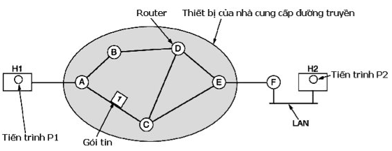
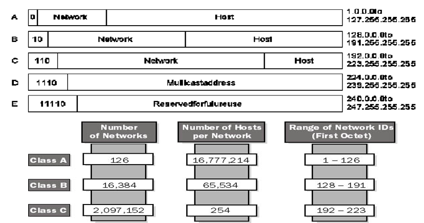

# Tầng mạng
# Một số hạn chế của tầng liên kết dữ liệu

- Chỉ đảm bảo truyền tải thông tin giữa các máy tính có đường truyền trực tiếp.
- Bị giới hạn về số lượng máy tính và phạm vi mạng
- Khó khăn trong việc nối kết các mạng sử dụng các kỹ thuật chia sẻ đường truyền khác nhau – các mạng không đồng nhất

# Vai trò của tầng mạng

- Cung cấp cho người dùng một dịch vụ nối kết host-to-host trên một hệ thống mạng diện rộng, không đồng nhất.
- Chuyển các gói tin từ máy gởi qua các chặn đường để đến được máy nhận.
- Chọn đường đi tốt nhất cho các gói tin để tránh được tình trạng tắc nghẽn mạng.

# Các vấn đề liên quan đến việc thiết kế tầng mạng

- Kỹ thuật hoán chuyển lưu và chuyển tiếp (Store-and-Forward Switching)
  
- Các dịch vụ cung cấp cho tầng vận chuyển, cần độc lập với kỹ thuật của các router.
  - Tầng vận chuyển cần được độc lập với số lượng, kiểu và hình trạng của các router hiện hành.
  - Địa chỉ mạng cung cấp cho tầng vận chuyển phải có sơ đồ đánh số nhất quán cho dù chúng là LAN hay WAN
- Cung cấp 02 dịch vụ cơ bản:
  - Không nối kết (Connectionless Service)
  - Định hướng nối kết (Connection Oriented Service)

## Dịch vụ không nối kết

- Các gói tin được đưa vào Subnet một cách riêng lẽ và được vạch đường một cách độc lập nhau.
- Không cần thiết phải thiết lập nối kết trước khi truyền tin.
- Các gói tin được gọi là Datagram và Subnet được gọi là Datagram Subnet.
  
- Giải thuật chịu trách nhiệm quản lý thông tin trong bảng chọn đường cũng như thực hiện các quyết định về chọn đường được gọi là Giải thuật chọn đường (Routing algorithm)

## Dịch vụ hướng nối kết

- Một kết nối giữa bên gởi và bên nhận phải được thiết lập trước khi các gói tin có thể được gởi đi.
- Nối kết này được gọi là mạch ảo (Virtual Circuit) tương tự như mạch vật lý được nối kết trong hệ thống điện thoại.
  
- Mỗi gói tin có mang một số định dạng để xác định mạch ảo mà nó thuộc về

# So sánh giữa Datagram subnet và Virtual-Circuit

| Vấn đề                           | Datagram Subnet                                                       | Circuit Subnet                                                                                  |
| -------------------------------- | --------------------------------------------------------------------- | ----------------------------------------------------------------------------------------------- |
| **Thiết lập nối kết**            | Không cần.                                                            | Cần thiết.                                                                                      |
| **Đánh địa chỉ**                 | Mỗi gói tin chứa đầy đủ địa chỉ gởi và nhận.                          | Mỗi gói tin chỉ chứa số nhận dạng nối kết, có kích thước nhỏ.                                   |
| **Thông tin trạng thái**         | Router không cần phải lưu giữ thông tin trạng thái của các nối kết.   | Mỗi nối kết phải được lưu lại trong bảng chọn đường của router.                                 |
| **Chọn đường**                   | Mỗi gói tin có đường đi khác nhau.                                    | Đường đi được chọn khi mạch ảo được thiết lập, sau đó tất cả các gói tin đều đi trên đường này. |
| **Ảnh hưởng khi router bị hỏng** | Không bị ảnh hưởng, ngoại trừ gói tin đang trên đường truyền bị hỏng. | Tất cả các mạch ảo đi qua router bị hỏng đều bị kết thúc.                                       |
| **Chất lượng dịch vụ**           | Khó đảm bảo.                                                          | Có thể thực hiện dễ dàng nếu có đủ tài nguyên gán trước cho từng nối kết.                       |
| **Điều khiển tắc nghẽn**         | Khó điều khiển.                                                       | Có thể thực hiện dễ dàng nếu có đủ tài nguyên gán trước cho từng nối kết.                       |

# Giải thuật chọn đường

- Mục tiêu: là xác định đường đi tốt nhất (chuỗi các router -nút) xuyên qua mạng từ máy gởi đến máy nhận
- Cần đồ thị hóa hệ thống mạng cho các giải thuật chọn đường:
- Nút là các host, switch, router hoặc là các mạng con.
- Cạnh của đồ thị tương ứng với các đường nối kết mạng.
- Mỗi cạnh có một chi phí đính kèm, là thông số chỉ ra cái giá phải trả khi lưu thông trên nối kết mạng đó

## Phân loại

- **Chọn đường tập trung (Centralized routing):** Trong mạng có một Trung tâm điều khiển mạng chịu trách nhiệm tính toán và cập nhật thông tin về đường đi đến tất cả các điểm khác nhau trên toàn mạng cho tất cả các router.
- **Chọn đường phân tán (Distributed routing):** Mỗi router phải tự tính toán tìm kiếm thông tin về các đường đi đến những điểm khác nhau trên mạng. Để làm được điều này, các router cần phải trao đổi thông tin qua lại với nhau.
- **Chọn đường tĩnh (Static routing):** Các router không thể tự cập nhật thông tin về đường đi khi hình trạng mạng thay đổi. Nhà quản trị mạng sẽ là người cập nhật thông tin về đường đi cho router.
- **Chọn đường động (Dynamic routing):** Các router sẽ tự động cập nhật lại thông tin về đường đi khi hình trạng mạng hay tải đường truyền bị thay đổi.

## Các giải thuật chọn đường tối ưu

- Đường đi tối ưu từ A đến B là đường đi “Ngắn Nhất” trong số các đường đi có thể.
- Khái niệm “Ngắn Nhất” có thể hiểu theo nhiều ý nghĩa tuỳ thuộc vào đơn vị để đo chiều dài đường đi
- Số lượng các Router trung gian phải qua (HOP)
- Độ trì hoãn trung bình của các gói tin.
- Cước phí truyền tin.
- Mỗi giải thuật chọn đường trước tiên phải chọn cho mình một đơn vị đo.

## Giải thuật tìm đường đi ngắn nhất Dijkstra

- Mục đích: tìm đường đi ngắn nhất từ một nút cho trước trên đồ thị đến các nút còn lại trên mạng
- Thuộc loại giải thuật tìm đường đi tối ưu tập trung
- Giả thuật được mô tả như sau:
- Giả sử, gọi:
  - $S$: là nút nguồn cho trước
  - $N$: là tập hợp tất cả các nút đã xác định được đường đi ngắn nhất từ $S$.
  - $D_i$: là độ dài đường đi ngắn nhất từ nút nguồn S đến nút i.
  - $l_{ij}$: là giá của cạnh nối trực tiếp nút i với nút j, sẽ là $\infty$ nếu không có cạnh nối trực tiếp giữa i và j.
  - $P_j$ là nút cha của của nút j.
- Bước 1: Khởi tạo
  $N=\{S\};  D_s=0;$
  Với $\forall i \neq S: D_i=l_{si} , P_i=S$
- Bước 2: Tìm nút gần nhất kế tiếp
  - Tìm nút $i \not \in N$ $D_i= min (D_j)$ với $j \not \in N$
  - Thêm nút i vào N.
  - Nếu N chứa tất cả các nút của đồ thị thì dừng. Ngược lại sang Bước 3
- Bước 3: Tính lại giá đường đi nhỏ nhất
  - Với mỗi nút $j \not \in N:$
  - Tính lại $D_j= min\{ D_j, D_i+ l_{ij}\}; P_j=i;$
  - Trở lại Bước 2

## Giải thuật chọn đường tối ưu Ford-Fulkerson

- Mục đích của giải thuật này là để tìm đường đi ngắn nhất từ tất cả các nút đến một nút đích cho trước trên mạng
- Thuộc loại giải thuật tìm đường đi tối ưu – phân tán
- Giả sử, Gọi
  - d là nút đích cho trước
  - $D_i$ là chiều dài đường đi ngắn nhất từ nút i đến nút d.
  - $C_i$ là nút con của nút i
- Bước 1: Khởi tạo:
  - Gán $D_d = 0;$
    Với $\forall i \neq d:$ gán $D_i= \infty ; C_i= -1;$
  - Bước 2: Cập nhật giá đường đi ngắn nhất từ nút i đến nút d
  $D_i= min\{l_{ij}+ D_j\}$ với $\forall j \neq i => C_i = j;$
Lặp lại cho đến khi không còn $D_i$ nào bị thay đổi giá trị

## Giải pháp vạch đường Vector Khoảng cách (Distance Vector)

- Mỗi nút thiết lập một mảng một chiều (vector) chứa khoảng cách (chi phí) từ nó đến tất cả các nút còn lại và sau đó phát vector này đến tất cả các nút láng giềng của nó.
- Giả thiết
  - Mỗi nút phải biết được chi phí của các đường nối từ nó đến tất cả các nút láng giềng
  - Một nối kết bị đứt (down) sẽ được gán cho chi phí có giá trị vô cùng.
  Giao thức tìm đường RIP (Routing Information Protocol) đang sử dụng giải pháp này.

- Một số vấn đề cần quan tâm:
  - Thời điểm gởi thông tin vạch đường của mình cho các nút láng giềng:
    - Cập nhật theo chu kỳ
    - Cập nhật do bị kích hoạt khi có sự thay đổi thông tin trong bảng vạch đường của nút
  - Kiểm tra sự hiện diện của láng giềng
    - Gởi thông điệp hỏi thăm sức khỏe định kỳ
    - Không thấy bảng chọn đường của láng giềng gởi sang
  - Khi phát hiện đường truyền bị sự cố:
    - Router sẽ cập nhật đường đi tương ứng với giá vô cùng và gởi bảng chọn đường mới sang láng giềng
  - Vấn đề vòng quẩn trong cập nhật bảng vạch đường.

## Giải pháp chọn đường “Trạng thái nối kết” (Link State)

Mỗi nút được giả định có khả năng tìm ra trạng thái của đường nối nó đến các nút láng giềng và chi phí trên mỗi đường nối đó.
Mọi nút đều biết đường đi đến các nút láng giềng kề bên chúng và nếu chúng ta đảm bảo rằng tổng các kiến thức này được phân phối cho mọi nút thì mỗi nút sẽ có đủ hiểu biết về mạng để dựng lên một bản đồ hoàn chỉnh của mạng
Mỗi nút sẽ chạy một giải thuật tìm đường đi trên hình trạng của toàn mạng để tìm đường tốt nhất đi tới các nút khác.
Giao thức tìm đường OSPF (Open Short Parth First) sử dụng giải pháp này.
Làm ngập một cách tin cậy (Reliable Flooding)

- Đảm bảo tất cả các nút tham gia vào giao thức vạch đường đều nhận được thông tin về trạng thái nối kết từ tất cả các nút khác
- Một nút phát thông tin về trạng thái nối kết của nó với mọi nút láng giềng liền kề, đến lượt mỗi nút nhận được thông tin trên lại chuyển phát thông tin đó ra các nút láng giềng của nó. Tiến trình này cứ tiếp diễn cho đến khi thông tin đến được mọi nút trong mạng
- Mỗi nút tạo ra gói tin cập nhật, còn được gọi là gói tin trạng thái nối kết (link-state packet – LSP), chứa :
  - ID của nút đã tạo ra LSP
  - Một danh sách các nút láng giềng có đường nối trực tiếp tới nút đó, cùng với chi phí của đường nối đến mỗi nút.
  - Một số thứ tự
  - Thời gian sống (time to live) của gói tin này


## Vạch đường phân cấp (Hierarchical Routing)

- Khi mạng tăng kích thước:
  - Tăng kích thước bảng vạch đường của các router
  - Tăng kích thước bộ nhớ lưu trữ các bảng vạch đường.
  - Tăng thời gian tìm kiếm đường đi
  - Tăng băng thông để truyền tải các bảng vạch đường
⇒ Cần thực hiện vạch đường phân cấp
- Trong vạch đường phân cấp:
  - Các router được chia thành những vùng (domain).
  - Các Router biết cách vạch đường bên trong vùng của nó, nhưng không biết gì về cấu trúc bên trong của các vùng khác.


# Liên mạng và bộ giao thức TCP/IP

## Liên mạng

- Liên mạng: Mạng được hình thành từ việc liên nối kết nhiều mạng lại với nhau
- Các mạng thành phần là không đồng nhất: khác nhau về phần cứng, phần mềm, giao thức
- Mục tiêu của việc xây dựng liên mạng là cho phép người dùng trên một mạng con có thể liên lạc được với người dùng trên các mạng con khác.

### Các hình thức xây dựng liên mạng

- Ở tầng vật lý: Các mạng được nối kết bằng các Repeater hoặc hub, những thiết bị chỉ đơn thuần làm nhiệm vụ di chuyển các bit từ mạng này sang mạng kia.
- Ở tầng LKDL: Dùng các cầu nối (bridges) hoặc switches. Chúng có thể nhận các khung, phân tích địa chỉ MAC và cuối cùng chuyển khung sang mạng khác, đồng thời chúng cũng làm nhiệm vụ giám sát quá trình chuyển đổi giao thức (vd: Ethernet<->Wireless).
- Ở tầng mạng: Dùng các Router để nối kết các mạng với nhau. Nếu hai mạng có tầng mạng khác nhau, router có thể chuyển đổi khuôn dạng gói tin, quản lý nhiều giao thức khác nhau trên các mạng khác nhau.
- Ở tầng vận chuyển: Dùng các gateway vận chuyển, thiết bị có thể làm giao diện giữa hai đầu nối kết mức vận chuyển. Ví dụ gateway có thể làm giao diện trao đổi giữa hai nối kết TCP và SPX.
- Ở tầng ứng dụng: Các gateway ứng dụng sẽ làm nhiệm vụ chuyển đổi ngữ cảnh của các thông điệp. Ví dụ như gateway giữa hệ thống email Internet và X.400 sẽ làm nhiệm vụ chuyển đổi nhiều trường trong header của email

### Liên mạng ở tầng mạng


- Hai router được nối với nhau bằng kết nối điểm-điểm.
- Máy S muốn gởi cho máy D một gói tin,
S đóng gói gói tin này thành một khung và gởi lên đường truyền LAN1.
- Khung đến được Router của LAN1,
  - router này liền bóc vỏ khung, lấy gói tin ra, tìm ra địa chỉ mạng (IP) của máy đích, địa chỉ này sẽ được tham khảo trong bảng vạch đường của router LAN1 để tìm đường đi đến LAN 2
  - router LAN1 quyết định chuyển gói sang router LAN2 bằng cách đóng thành khung gởi cho router LAN2.
  
## Bộ giao thức liên mạng (TCP/IP – Transmission Control Protocol/Internet Protocol)

- Được phát triển vào giữa những năm của thập niên 70 bởi môt dự án của Văn phòng các dự án nghiên cứu chuyên sâu của bộ quốc phòng Mỹ (DARPA-Defense Advanced Research Projects Agency )
- Mục đích: xây dựng một mạng chuyển mạch gói (packet-switched network) cho phép việc trao đổi thông tin giữa các hệ thống máy tính khác nhau của các viện nghiên cứu.
- TCP/IP Là bộ giao thức liên mạng cho các hệ thống mở nổi tiếng nhất trên thế giới
- Được sử dụng để giao tiếp qua bất kỳ các liên mạng nào cũng như thích hợp cho các giao tiếp trong mạng LAN và mạng WAN.
- TCP/IP được tích hợp vào hệ điều hành UNIX phiên bản BSD (Berkeley Software Distribution)
- Hiện nay trở thành nền tảng cho mạng Internet và dịch vụ WWW (World Wide Web)

  

### Giao thức liên mạng IP (Internet protocol)

- Hoạt động ở tầng 3 của mô hình OSI, được đặc tả trong RFC 791.
- Qui định cách thức định địa chỉ các máy tính và cách thức chuyển tải các gói tin qua một liên mạng.
- Cùng với giao thức TCP, IP trở thành trái tim của Bộ giao thức Internet.
- Hai chức năng chính
  - Cung cấp dịch vụ truyền tải dạng không nối kết để chuyển tải các gói tin qua một liên mạng
  - Phân mãnh cũng như tập hợp lại các gói tin để hỗ trợ cho tầng liên kết dữ liệu với kích thước đơn vị truyền dữ liệu là khác nhau.
  
### Cấu trúc gói tin của giao thức IPv4


### Địa chỉ IP

- IP Address: địa chỉ IP là một số 32 bit được sử dụng để định danh duy nhất một máy tính trên mạng TCP/IP.

  

Địa chỉ IP thường được mô tả dưới dạng 04 số thập phân cách nhau bởi dấu chấm

```
10101100.00010010.11001000.00000010
  172   .   18   .  200   .   2
```

- Một địa chỉ IP gồm 02 phần: Network ID và Host ID
  - Network ID: xác định các TCP/IP hosts trong cùng một nhánh mạng, tất cả các TCP/IP host trong cùng một nhánh mạng phải có cùng network ID
  
  - Host ID: xác định một TCP/IP host trong một mạng, Host ID phải là duy nhất trong một network ID
  

### Mặt nạ mạng (Subnet mask)

Dùng để xác định địa chỉ mạng từ địa chỉ IP
Địa chỉ mạng = Địa chỉ IP && mặt nạ mạng

```
Lớp IP     Mặt nạ mạng
A          255.0.0.0
B          255.255.0.0
C          255.255.255.0
```

Thí dụ: IP = 191.2.2.41
⇒ Lớp B Mặt nạ mạng = 255.255.0.0
⇒ Địa chỉ mạng $= 191.2.2.41 \quad \&\& \quad 255.255.0.0 \\ \qquad\qquad\qquad = 191.2.0.0$

### Một số địa chỉ IP đặc biệt

- Địa chỉ mạng (Network Address): là địa chỉ IP mà giá trị của _tất cả các bits ở phần nhận dạng máy tính đều là 0_, được sử dụng để xác định một mạng.
- Ví dụ : 10.0.0.0; 172.18.0.0 ; 192.1.1.0
- Địa chỉ quảng bá (Broadcast Address): Là địa chỉ IP mà giá trị của _tất cả các bits ở phần nhận dạng máy tính đều là 1_, được sử dụng để chỉ tất cả các máy tính trong mạng.
- Ví dụ : 10.255.255.255, 172.18.255.255, 192.1.1.255
  Không được dùng để đặt cho các máy tính
- Địa chỉ mạng (Loopback) 127.0.0.0 được dành riêng để đặt trong phạm vi một máy tính. Nó chỉ có giá trị cục bộ ( trong phạm vi một máy tính). Khi cài đặt giao thức IP thì máy tính sẽ được gián địa chỉ 127.0.0.1. Địa chỉ này thông thường để kiểm tra xem giao thức IP trên máy hiện tại có hoạt động không.
- Địa chỉ dành riêng (Private IP Address) cho mạng cục bộ không nối kết trực tiếp Internet:
  - Lớp A : 10.0.0.0
  - Lớp B : 172.16.0.0 đến 172.32.0.0
  - Lớp C : 192.168.0.0 – 192.168.255.0
  
# Phân mạng con (Subneting)
Phân mạng con là một kỹ thuật cho phép nhà quản trị mạng chia một mạng thành những mạng con nhỏ, lợi ích :
- Đơn giản hóa việc quản trị: Với sự trợ giúp của các router, các mạng có thể được chia ra thành nhiều mạng con (subnet) mà chúng có thể được quản lý như những mạng độc lập.
- Tăng cường tính bảo mật của hệ thống: Phân mạng con sẽ cho phép một tổ chức phân tách mạng bên trong của họ thành một liên mạng, nhưng các mạng bên ngoài vẫn thấy đó là một mạng duy nhất.
- Cô lập các luồng giao thông trên mạng: Với sự trợ giúp của các router, giao thông trên mạng có thể được giữ ở mức thấp nhất có thể.
## Phương pháp phân mạng con
Nguyên tắc chung:
- Phần nhận dạng mạng (Network Id) của địa chỉ mạng ban đầu được giữ nguyên.
- Phần nhận dạng máy tính của địa chỉ mạng ban đầu được chia thành 2 phần:
  - Phần nhận dạng mạng con (Subnet Id)
  - Phần nhận dạng máy tính trong mạng con (Host Id).

Để phân mạng con, người ta phải xác định mặt nạ mạng con (Subnet mask).
Mặt nạ mạng con là một địa chỉ IP mà giá trị các bit ở Phần nhận dạng mạng (Network Id) và Phần nhận dạng mạng con (Subnet Id) đều là 1 trong khi giá trị của các bit ở Phần nhận dạng máy tính (Host Id) đều là 0.
Subnetwork Address = IP & Subnet mask
Có hai chuẩn để thực hiện phân mạng con là :
- Chuẩn phân lớp hoàn toàn (Classfull standard)
- Chuẩn Vạch đường liên miền không phân lớp CIDR (Classless Inter-Domain Routing )
CIDR chỉ mới được đa số các nhà sản xuất thiết bị và hệ điều hành mạng hỗ trợ nhưng vẫn chưa hoàn toàn chuẩn hóa.
### Phương pháp phân lớp hoàn toàn (Classfull Standard)
Địa chỉ IP khi phân mạng con sẽ gồm 3 phần:
- Phần nhận dạng mạng của địa chỉ ban đầu (Network Id):
- Phần nhận dạng mạng con (Subnet Id) : Được hình thành từ một số bit có trọng số cao trong phần nhận dạng máy tính (Host Id) của địa chỉ ban đầu
- Phần nhận dạng máy tính trong mạng con (Host Id) bao gồm các bit còn lại

Số lượng bits thuộc phần nhận dạng mạng con xác định số lượng mạng con.
- 4 bit, ta có $2^4=16$ mạng con.
- Phần nhận dạng mạng con gồm toàn bit 0 hoặc bit 1 không được dùng để đánh địa chỉ cho mạng con vì nó trùng với địa chỉ mạng và địa chỉ quảng bá của mạng ban đầu.
Ví dụ:
Cho địa chỉ mạng lớp C : 192.168.1.0 / 255.255.255.0.
Sử dụng 2 bit để làm phần nhận dạng mạng con.
Mặt nạ mạng con trong trường hợp này là 255.255.255.192.
Khi đó ta có các địa chỉ mạng con như sau:

| Địa chỉ IP   | Biểu diễn dạng thập phân | Octet 1   | Octet 2   | Octet 3   | Octet 4   |
|--------------|--------------------------|-----------|-----------|-----------|-----------|
| Mạng ban đầu | 192.168.1.0              | 11000000  | 10101000  | 00000001  | 00000000  |
| Mạng con 1   | 192.168.1.0              | 11000000  | 10101000  | 00000001  | 00000000  |
| Mạng con 2   | 192.168.1.64             | 11000000  | 10101000  | 00000001  | 01000000  |
| Mạng con 3   | 192.168.1.128            | 11000000  | 10101000  | 00000001  | 10000000  |
| Mạng con 4   | 192.168.1.192            | 11000000  | 10101000  | 00000001  | 11000000  |

### Qui trình phân mạng con

- Xác định số lượng mạng con cần phân, giả sử là **N**.
- Biểu diễn (**N+1)** thành số nhị phân.
  - Số lượng bit cần thiết để biểu diễn (**N+1)** chính là số lượng bit cần dành cho phần nhận dạng mạng con.
  - _Ví dụ N=6, khi đó biểu diễn của (6+1) dưới dạng nhị phân là 111. Như vậy cần dùng 3 bit để làm phần nhận dạng mạng con_
- Tạo mặt nạ mạng con
- Liệt kê tất cả các địa chỉ mạng con có thể, trừ hai mạng con mà ở đó phần nhận dạng mạng con toàn các bit 0 và các bit 1.
- Chọn ra N địa chỉ mạng con từ danh sách các mạng con đã liệt kê
  
### Phương pháp vạch đường liên miền không phân lớp

- CIDR (Classless Inter-Domain Routing)
- Một sơ đồ đánh địa chỉ mới cho Internet, hiệu quả hơn nhiều so với kiểu phân lớp A, B và C.
- Ra đời để giải quyết hai vấn đề bức xúc đối với mạng Internet là:
  - Thiếu địa chỉ IP
  - Vượt quá khả năng chứa đựng của các bảng chọn đường.
  Cấu trúc địa chỉ CIDR:
  - Không sử dụng cơ chế phân lớp A,B,C, D, E
  - Phần nhận dạng mạng: từ 13 đến 27 bit
  - Một địa chỉ theo cấu trúc CIDR:
    - Bao gồm 32 bit của địa chỉ IP chuẩn cùng với một thông tin
    - Bổ sung về số lượng các bit được sử dụng cho phần nhận dạng mạng
- Ví dụ : 206.13.1.48/25
  
| Số bits nhận dạng mạng (CIDR) | Lớp tương ứng (chuẩn phân lớp) | Số lượng máy tính |
|:------------------------------:|:-------------------------------:|:-----------------:|
| /27 | 1/8 lớp C | 32 |
| /26 | 1/4 lớp C | 64 |
| /25 | 1/2 lớp C | 128 |
| /24 | 1 lớp C | 256 |
| /23 | 2 lớp C | 512 |
| /22 | 4 lớp C | 1.024 |
| /21 | 8 lớp C | 2.048 |
| /20 | 16 lớp C | 4.096 |
| /19 | 32 lớp C | 8.192 |
| /18 | 64 lớp C | 16.384 |
| /17 | 128 lớp C | 32.768 |
| /16 | 256 lớp C (= 1 lớp B) | 65.536 |
| /15 | 512 lớp C | 131.072 |
| /14 | 1.024 lớp C | 262.144 |
| /13 | 2.048 lớp C | 524.288 |
