# TẦNG VẬN CHUYỂN

# Mục đích

- Vai trò của tầng vận chuyển và các chức năng mà tầng vận chuyển cung cấp cho tầng ứng dụng
- Ý nghĩa và cơ chế thiết lập nối kết và giải phóng nối kết cho các nối kết điểm – điểm
- Chi tiết về hai giao thức TCP và UDP thuộc tầng vận chuyển

# Nhiệm vụ của tầng vận chuyển

- Tầng mạng đảm bảo truyền tải kiểu
- Host -to- Host
- Tầng vận chuyển đảm bảo truyền tải kiểu End point –to- End point
- End point là các chương trình ứng dụng chạy trên các host.
- Cung cấp dịch vụ vận chuyển gói tin hiệu quả, tin cậy và tiết kiệm.

# Vị trí của tầng vận chuyển

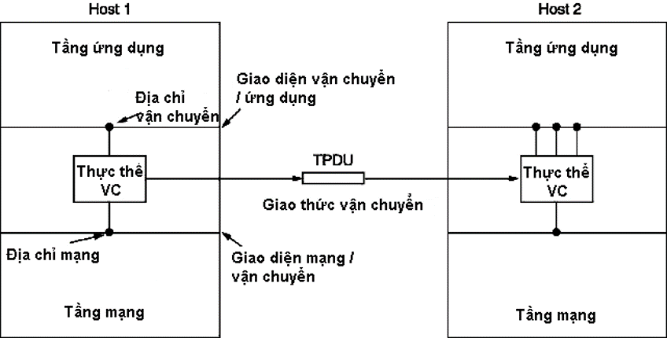

# Dịch vụ cung cấp bởi tầng vận chuyển

- Hai kiểu dịch vụ
- Có nối kết :
  - Thiết lập nối kết,
  - Truyền dữ liệu
  - Hủy nối kết
- Không nối kết
- Các hàm dịch vụ cơ sở để triệu gọi các dịch vụ vận chuyển, các hàm này là đơn giản, duy nhất và độc lập với các hàm cơ sở ở tầng mạng.

## Các hàm dịch vụ cơ sở - Có nối kết

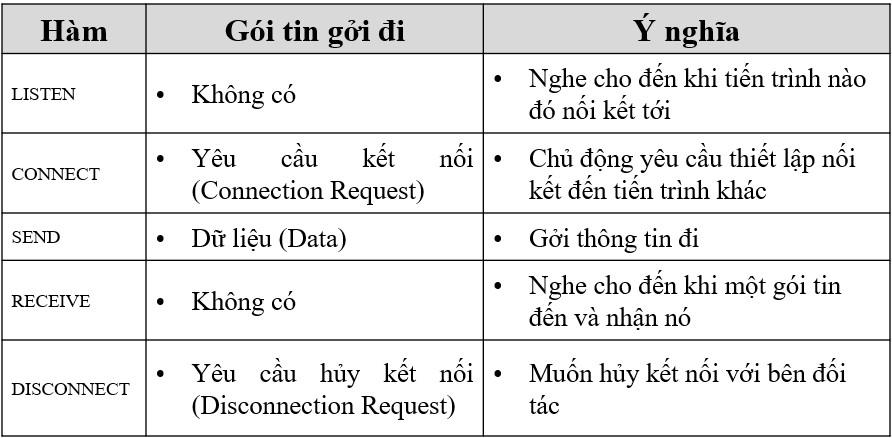

## Các hàm dịch vụ cơ sở - Không nối kết

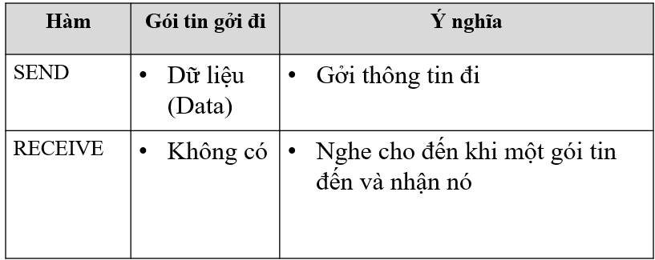

# Các yếu tố cấu thành giao thức vận chuyển

- Điều khiển lỗi, đánh số thứ tự gói tin và điều khiển luồng dữ liệu.
- Môi trường giao tiếp qua một tập các mạng trung gian
- Những vấn đề cần quan tâm:
  - Định địa chỉ các tiến trình trên các host
  - Xử lý những trường hợp mất gói tin, gói tin đi chậm dẫn đến mãn kỳ (time out) và gởi thêm một gói tin bị trùng lắp,
  - Đồng bộ hóa hai tiến trình đang trao đổi dữ liệu khi mà chúng đang ở rất xa nhau

## Định địa chỉ

- Khi một tiến trình muốn thiết lập kết nối tới một tiến trình khác ở xa, nó phải chi ra rằng nó muốn kết nối với tiến trình nào.
- Địa chỉ tiến trình là TSAP (Transport Service Access Point)
- Mạng Internet là dùng số hiệu cổng (port),
- Mạng ATM là AAL-SAP (ATM Adaption Layer –Service Access Point).
- Ở tầng mạng được gọi là NSAP

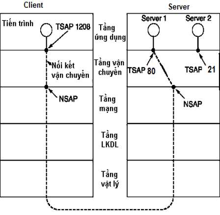

## Thiết lập nối kết

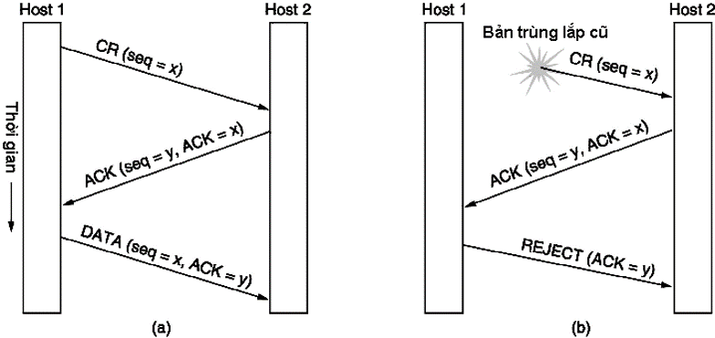

- Three-way hand-shake
- Hoạt động bình thường.
- Bản CR bị trùng lắp

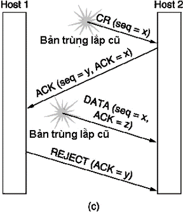

- Cả CR và ACK đều bị trùng lắp

## Giải phóng nối kết

- Hai kiểu giải phóng nối kết:
  - Kiểu dị bộ hoạt động như sau: khi một bên cắt nối kết, kết nối sẽ bị hủy bỏ (giống như trong hệ thống điện thoại).
  - Kiểu đồng bộ làm việc theo phương thức ngược lại: khi cả hai đồng ý hủy bỏ nối kết, nối kết mới thực sự được hủy

### Giải phóng nối kết dị bộ

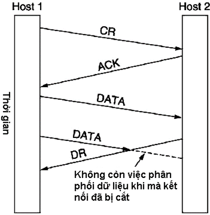

### Giải phóng nối kết đồng bộ

- Một nút phải tiếp tục nhận dữ liệu sau khi đã gởi đi yêu cầu giải phóng nối kết (DISCONNECT REQUEST – CR), cho đến khi nhận được chấp thuận hủy bỏ nối kết của bên đối tác đó
- Sử dụng phương pháp hủy nối kết ba chiều cùng với bộ định thời

- Bình thường

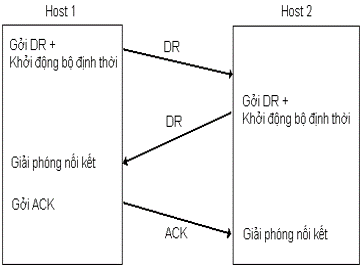

- Khung ACK cuối cùng bị mất

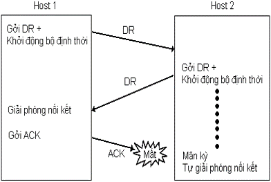

- Trả lời bị mất

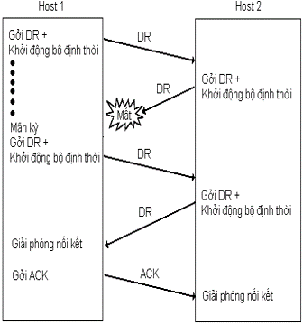

- Trả lời mất và các gói tin
- DR theo sau cũng bị mất

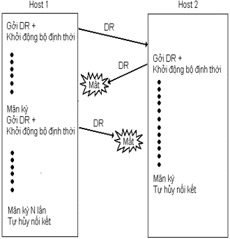

## Điều khiển thông lượng

- Sử dụng giao thức cửa sổ trượt với kích thước cửa sổ của bên gởi và bên nhận là khác nhau
- Cần phải có sơ đồ cung cấp buffer động:
  - Trước tiên, bên gởi phải gởi đến bên nhận một yêu cầu dành riêng số lượng buffer để chứa các gói bên gởi gởi đến.
  - Bên nhận cũng phải trả lời cho bên gởi số lượng buffer tối đa mà nó có thể cung cấp.
  - Mỗi khi báo nhận ACK cho một gói tin có số thứ tự SEQ_NUM, bên nhận cũng phải gởi kèm theo thông báo cho bên gởi biết là lượng buffer còn lại là bao nhiêu để bên gởi không làm ngập bên nhận

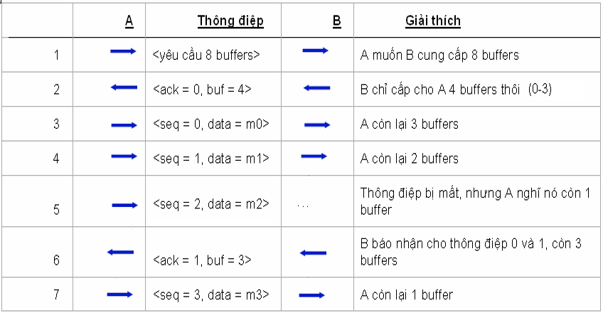

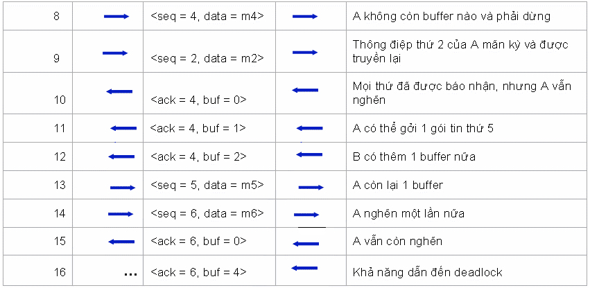

# Tầng vận chuyển trong mạng Internet

- Nhiệm vụ
  - Đảm bảo việc phân phối thông điệp qua mạng giữa các tiến trình.
  - Phân phối các thông điệp theo thứ tự mà chúng được gởi.
  - Không làm trùng lắp thông điệp.
  - Hỗ trợ những thông điệp có kích thước lớn.
  - Hỗ trợ cơ chế đồng bộ hóa.
  - Hỗ trợ việc liên lạc của nhiều tiến trình trên mỗi host.
  - Hỗ trợ hai phương thức hoạt động
    - Không nối kết (UDP)
    - Có nối kết (TCP)

## Giao thức UDP

(User Datagram Protocol)

- UDP là dịch vụ truyền dữ liệu dạng không nối kết.
- Không có thiết lập nối kết giữa hai bên truyền nhận.
- Gói tin UDP (segment) có thể xuất hiện tại nút đích bất kỳ lúc nào.
- Các segment UDP tự thân chứa mọi thông tin cần thiết để có thể tự đi đến đích.
- Checksum: Là phần kiểm tra lỗi tổng hợp trên phần header, phần dữ liệu và cả phần header ảo.
- Phần header ảo chứa 3 trường trong IP header: địa chỉ IP nguồn, địa chỉ IP đích, và trường chiều dài của UDP.
- Length: Tổng chiều dài của segment gồm cả phần header

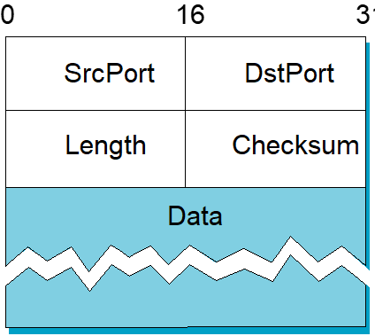

- Kiểm tra lỗi:
  - Xem thông điệp là một chuối các từ 16 bit.
  - Cộng dồn các từ này lại và lấy phần bù (0 ->1, 1->0)
  - Kết quả cuối cùng được ghi vào checksum

## Giao thức TCP

(Transmission Control Protocol)

- TCP là giao thức cung cấp dịch vụ vận chuyển tin cậy, hướng nối kết theo kiểu truyền thông tin bằng cách phân luồng các bytes.
- TCP là giao thức truyền song công, hỗ trợ cơ chế đa hợp (nhiều tiến trình trên một máy có thể đồng thời thực hiện đối thoại với đối tác của chúng)
- TCP là giao thức hướng bytes (bên gởi ghi các byte lên nối kết TCP, bên nhận đọc các byte từ nối kết TCP đó)

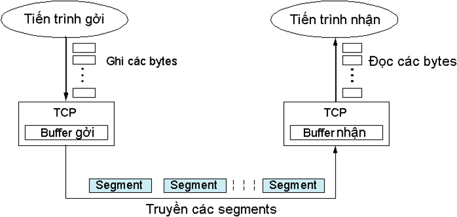

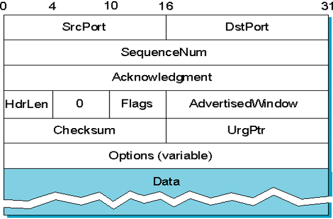

- Flags = [ SYN, FIN, RESET, PUSH, URG, ACK]

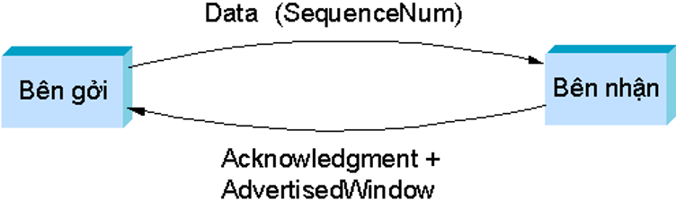

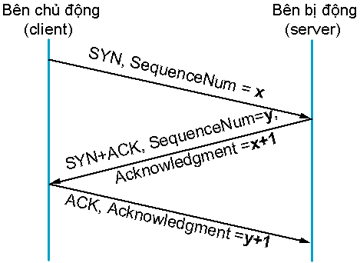

- Bắt tay trong TCP

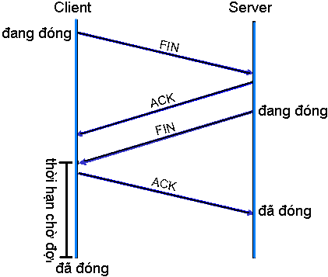

- Hủy bắt tay trong TCP

### Điều khiển thông lượng trong TCP

- Là giao thức truyền hướng bytes
- Mỗi lần truyền đi một Segment

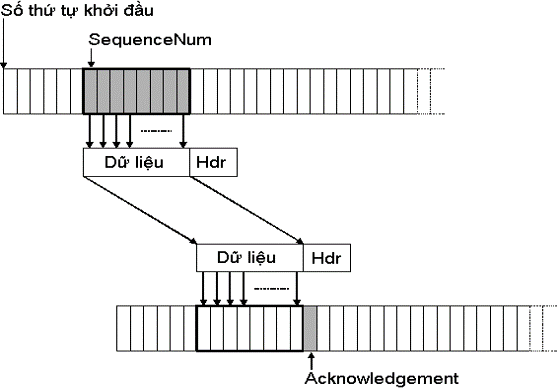

- Sử dụng giao thức cửa sổ trượt

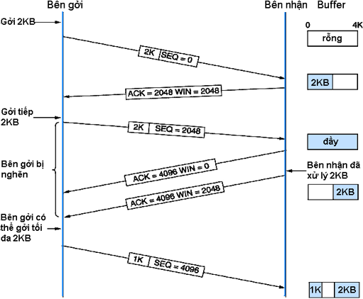
