# Tầng ứng dụng

# Giới thiệu về tầng ứng dụng

- Application: là các tiến trình phân tán và giao tiếp
- Chạy trên các máy tính mạng ở không gian người dùng (user space)
- Trao đổi các thông điệp
- e.g., email, ftp, Web
- Application-layer protocols
- Là một thành phần của ứng dụng.
- Định nghĩa các thông điệp được trao đổi và các tác vụ được thực hiện
- Sử dụng các dịch vụ của tầng vận chuyển (TCP/UDP).

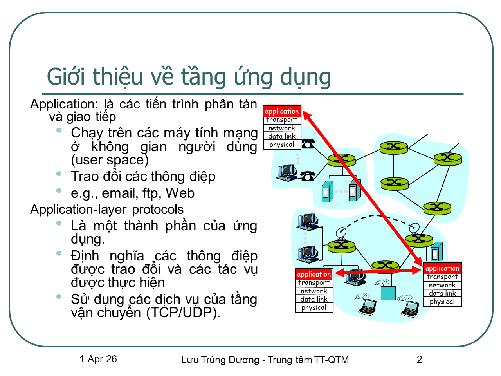

# Mô hình ứng dụng client – server

- Các ứng dụng được thiết kế gồm hai phần: client và server
- Client:
- Khởi tạo cuộc giao tiếp với server
- Yêu cầu các dịch vụ của Server
- Web: Web browser
- E-mail: Chương trình gởi nhận mail
- Server:
- Cung cấp các dịch vụ được yêu cầu bởi client
- Web server: gởi các trang web về client
- Mail server: phân phát email

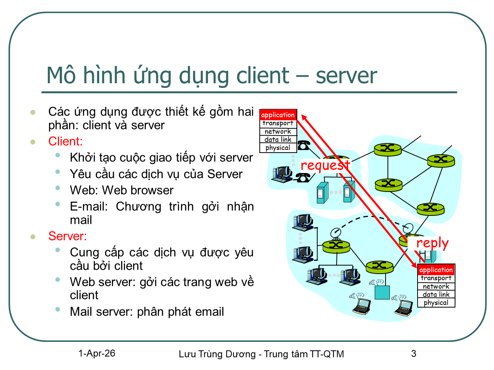

# Các dịch vụ (ứng dụng) tiêu biểu

- Hệ thống tên miền (DNS – Domain Name System)
- Dịch vụ thư điện tử (Email Service)
- Dịch vụ Web (Web service)
- Dịch vụ truyền tải tập tin (File Transfer Protocol)

# Giới thiệu về DNS

- Giao thức IP sử dụng địa chỉ IP để định vị các máy tính trong mạng, Ví dụ: 203.162.139.21
- Đối với các router, địa chỉ IP giúp việc vạch đường đi cho các gói tin được thực hiện một cách dễ dàng
- Đối với người sử dụng, địa chỉ IP khó nhớ để có thể truy vấn đến các dịch vụ
- Cần có cơ chế đặt tên cho các máy tính dễ nhớ hơn cho người sử dụng -> Domain Name System (DNS)
- Truy cập đến web site của ĐHCT bằng địa chỉ nào dễ nhớ hơn ?
- http://203.162.139.21
- http://www.ctu.edu.vn

- Người dùng
- Name Server
- www.cit.ctu.edu.vn
- TCP
- http://www.cit.ctu.edu.vn
- www.cit.ctu.edu.vn
- IP
- 203.162.36.146
- Name Agent
- Web Browser
- 203.162.36.148
- 203.162.36.146
- 203.162.36.146
- TCP
- 203.162.36.146
- IP
- IP
- Web Server
- DNS là một cơ sở dữ liệu phân tán, được sử dụng trên hệ thống mạng TCP/IP (đặc biệt là Internet), để chuyển tên (theo kiểu tên miền) của máy tính thành địa chỉ IP tương ứng (và ngược lại)
- TCP
- IP
- 203.162.36.146

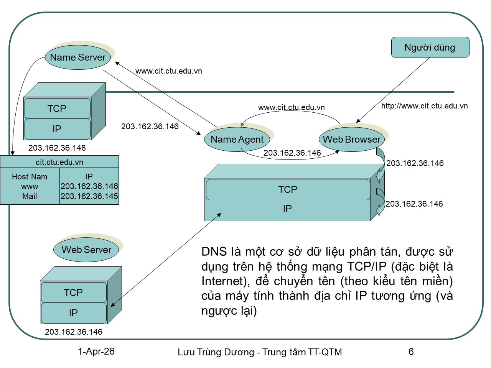

- DNS (Domain Name System) là giải pháp dùng tên luận lý (tên miền) thay cho địa chỉ IP khó nhớ khi sử dụng các dịch vụ trên mạng
- Ví dụ: www.ctu.edu.vn
- vn : Việt nam
- edu: Tổ chức thuộc lĩnh vực giáo dục
- ctu : Đại học Cần Thơ
- www: Tên máy tính làm chức năng máy chủ web của ĐHCT
- Tên DNS tồn tại lâu hơn IP, IP của một máy tính thường thay đổi nhưng tên DNS của máy thường không thay đổi.
- Cho phép người dùng kết nối tới các Server cục bộ bằng cách sử dụng khái niệm đặt tên của Internet

# Các thành phần chính DNS

- Máy chủ tên miền (DNS servers): Quản lý CDSL của DNS
- Bộ phân giải DNS (DNS revolvers): DNS Client
- Các mẫu tin tài nguyên DNS (DNS resource records): Các ánh xạ giữa tên miền và địa chỉ IP trong CSDL của DNS
- Các vùng DNS (DNS zones): một phần không gian tên miền, thường là miền của một tổ chức

# Các khái niệm của DNS Domain Namespace

- Domain Namespace: là cơ chế đặt tên có cấu trúc có thứ bậc của DNS
- Khi domain con được (Sub-domain) tạo ra, theo sau tên của nó là tên của domain cha
- Tên của domain con là duy nhất trong domain cha.
- => Ta có thể xác định được vi trí của một domain trong hệ thống phân cấp một cách dễ ràng

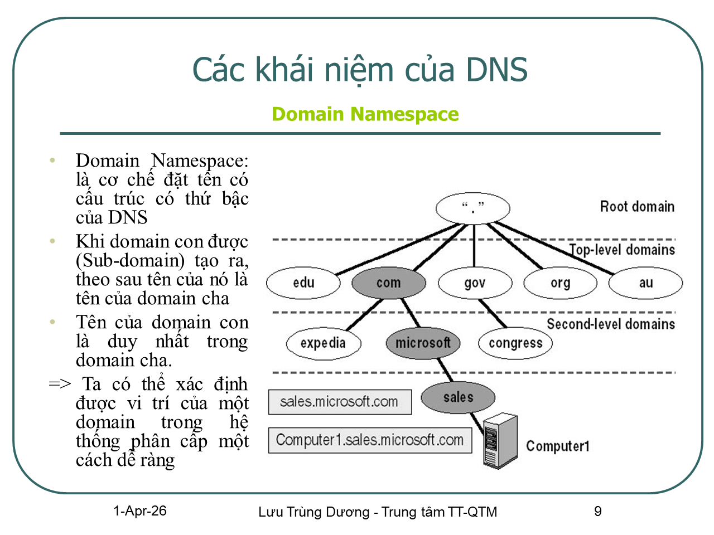

# Các nguyên tắc để tạo Domain Namespace

- Hệ thống có thứ cấp Domain Namespace có từ ba hoặc bốn mức
- Tên được gán cho mỗi domain nên phải ngắn gọn, đơn giản và có ý nghĩa
- Các kí tự thường được sử dụng để đặt tên là: A-Z, a-z, 0-9 và dấu nối (-)
- Hiện nay tên DNS hỗ trợ chuẩn Unicode

# Các Zones - Vùng

- Là một phần không gian tên miền liên tục và được uỷ quyển quản lý cho một máy chủ DNS

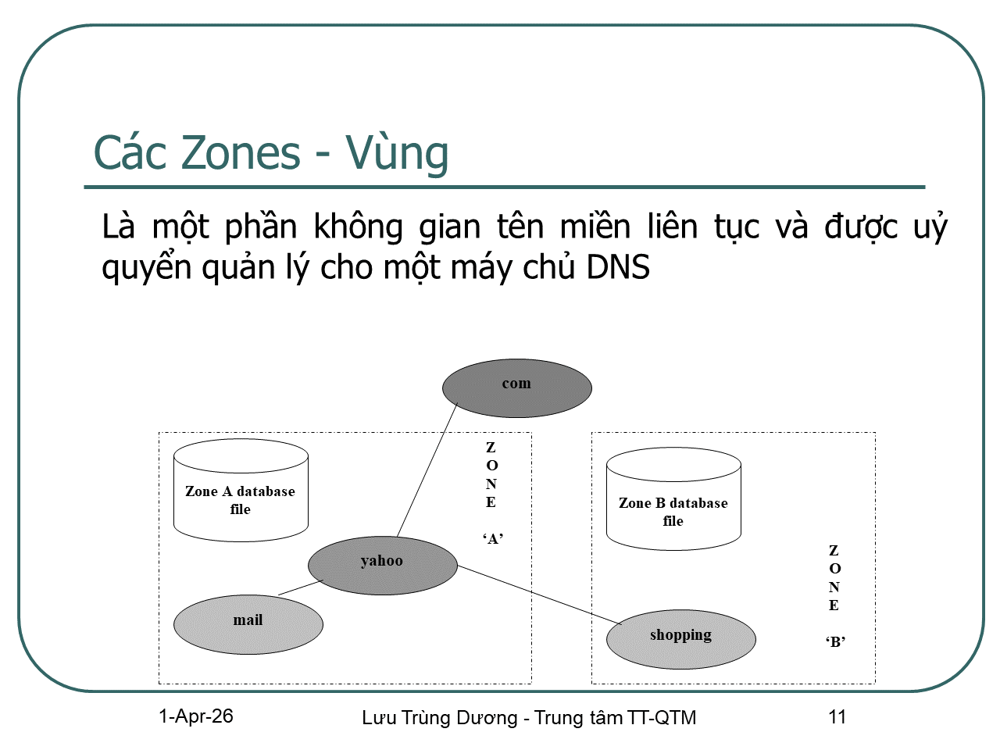

# Chuyển vùng

- Một vùng có thể có được quản lý bởi nhiều DNS server.
- DNS Server chính quản lý cơ sở dữ liệu chính của vùng.
- Các DNS server phụ chứa bản sao của cơ sở dữ liệu của vùng.
- Khi CSDL chính thay đổi ->quá trình nhân bản cơ sở dữ liệu vùng xảy ra -> được gọi là chuyển vùng
- Có hai loại chuyển vùng
- Chuyển vùng hoàn toàn (AXFR)
- Chuyển vùng gia tăng (IXFR)

# MÁY CHỦ TÊN MIỀN NAME SERVER

- NS quản lý CSDL của vùng. Một NS có thể quản lý CSDL của một hoặc nhiều zone.
- Một NS chứa “Primary Zone database file”, cho một zone nào đó -> ít nhất phải có một NS cho một zone.
- Việc thay đổi trên một zone, phải được thực hiện trên NS chứa “Primary zone database file”.
- Những NS khác của vùng hoạt động như Backup NS.
- Caching NS: trữ lại các yêu cầu phân tích tên đã giải quyết để tăng tốc độ phân tích tên. Không quản lý Zone

# Các mẩu tin trong CSDL của DNS

- (Tên, Giá trị, Kiểu, Lớp, TTL)
- Tên ánh xạ Giá trị
- www.cit.ctu.edu.vn -> 203.162.36.146
- 203.162.36.146 -> www.cit.ctu.edu.vn
- Kiểu: Chỉ ra cách thức mà Giá trị được thông dịch
- Lớp: Cho phép thêm vào các thực thể không do NIC quản lý (Thông thường là IN)
- TTL: Thời gian sống, xác định khoảng thời gian và mẩu tin sẽ lưu trên cache.

- (Tên, Giá trị, Kiểu, Lớp, TTL)
- Kiểu A: Tên miền sang địa chỉ IP
- (ns.ctu.edu.vn, 203.162.41.166, A, IN)
- Kiểu NS: Tên miền và Name Server của nó
- (ctu.edu.vn, ns.ctu.edu.vn, NS, IN)
- Kiểu CNAME: Bí danh cho một tên máy tính đã có
- (dns.ctu.edu.vn, ns.ctu.edu.vn, CNAME, IN)
- Kiểu MX: Tên miền và Mail Server cho miền đó
- (ctu.edu.vn, mail.ctu.edu.vn, MX, IN)

- Root name server chứa
- Chứa một mẫu tin NS cho mỗi server cấp một.
- sử dung một mẫu tin A để thông dịch từ một tên server cấp 1 sang địa chỉ IP của nó.
- (vn, dns1.vnnic.net.vn, NS, IN);
- (dns1.vnnic.net.vn, 203.162.57.105, A, IN)
- Tương tự cho các Name Server thứ cấp
- dns1.vnnic.net.vn:
- (edu.vn, ns.edu.vn, NS, IN)
- (ns.edu.vn, 203.162.41.166, A, IN)
- ns.ctu.edu.vn:
- (ctu.edu.vn, ns.ctu.edu.vn, NS, IN)
- (ns.ctu.edu.vn, 203.162.36.144, A, IN)
- 203.162.57.105
- Server tên
- của khối edu
- 203.162.41.166
- Server tên
- của ctu
- 203.162.36.144

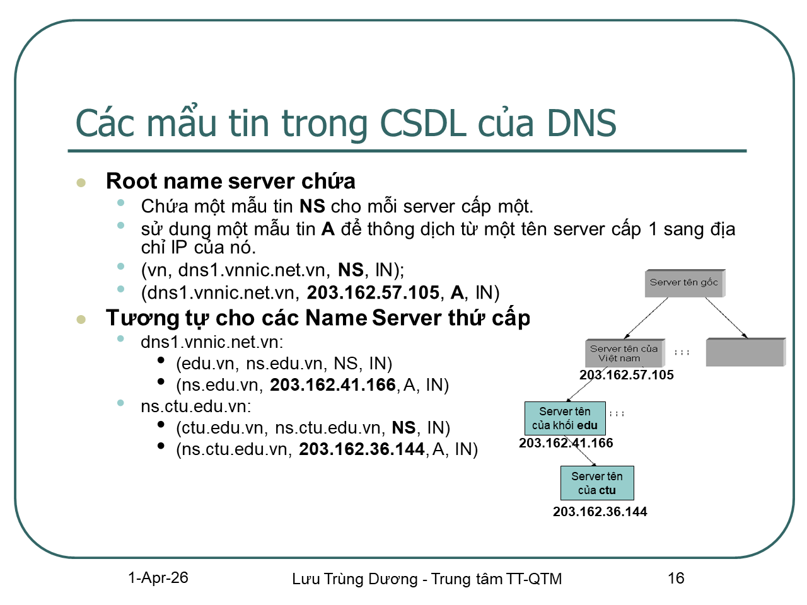

# Tiến trình phân giải tên

- Mỗi Name Server biết địa chỉ của ít nhất một Root Name Server:
- ( . , a.root-servers.net, NS, IN)
- (a.root-server.net, 198.41.0.4, A, IN)
- Quá trình phân giải tên theo kiểu DNS của một máy thành địa chỉ IP tương ứng được gọi là giải tên
- Forward Lookup Query : Giải tên của một địa chỉ IP kết hợp
- VD: www.ctu.edu.vn -> 203.162.139.21
- Reverse Lookup Query : Giải địa chỉ IP của một tên kết hợp
- VD: 203.162.139.21 -> www.ctu.edu.vn

- root name server
- 198.41.0.4
- .vn
- 203.162.57.105
- princeton.edu
- dns.princeton.edu
- www.ctu.edu.vn
- .edu.vn
- 203.162.41.166
- www.ctu.edu.vn
- www.ctu.edu.vn
- www.ctu.edu.vn
- cs.princeton.edu
- dns.cs.princeton.edu
- www.ctu.edu.vn
- www.ctu.edu.vn
- MrBlabla.cs.princeton.edu
- Mr Blabla

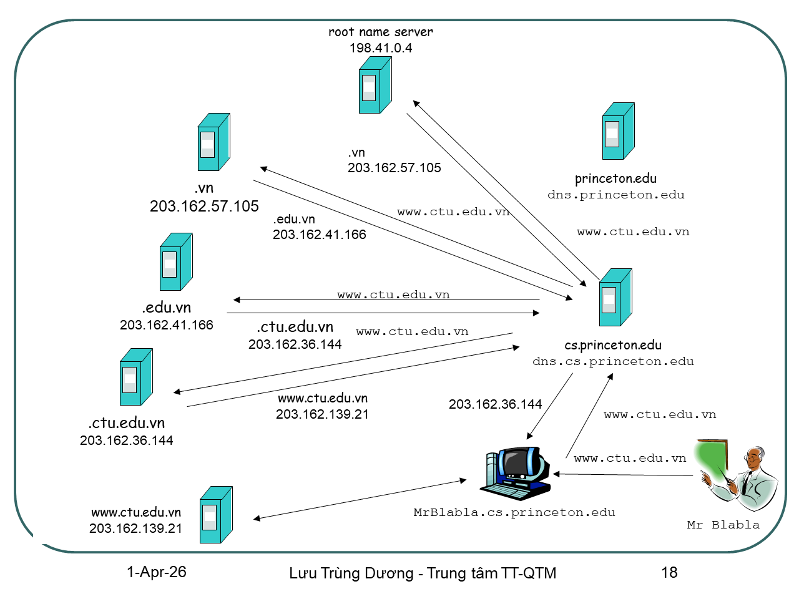

# Thư điện tử (Email – Electronic Mail)

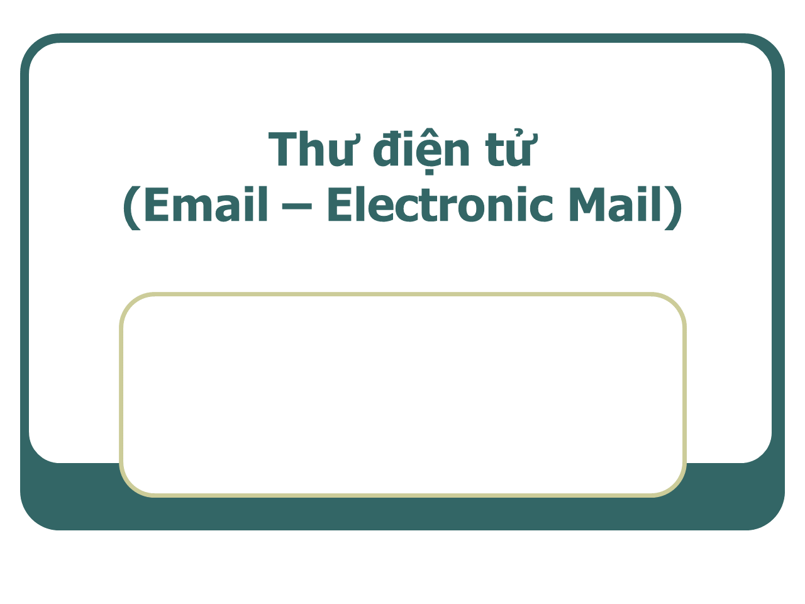

# Giới thiệu về hệ thống thư điện tử

- Gởi nhận thư thông qua hệ thống mạng máy tính
- Hệ thống gồm 3 thành phần chính
- User Agent
- Mail Server
- Mail Protocols

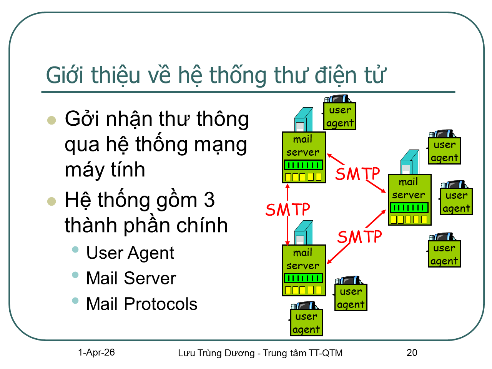

- User Agent (Mail reader)
- Soạn thư, trả lời thư, đọc thư…
- VD: Eudora, Outlook, Netscape Messenger, Pmail…

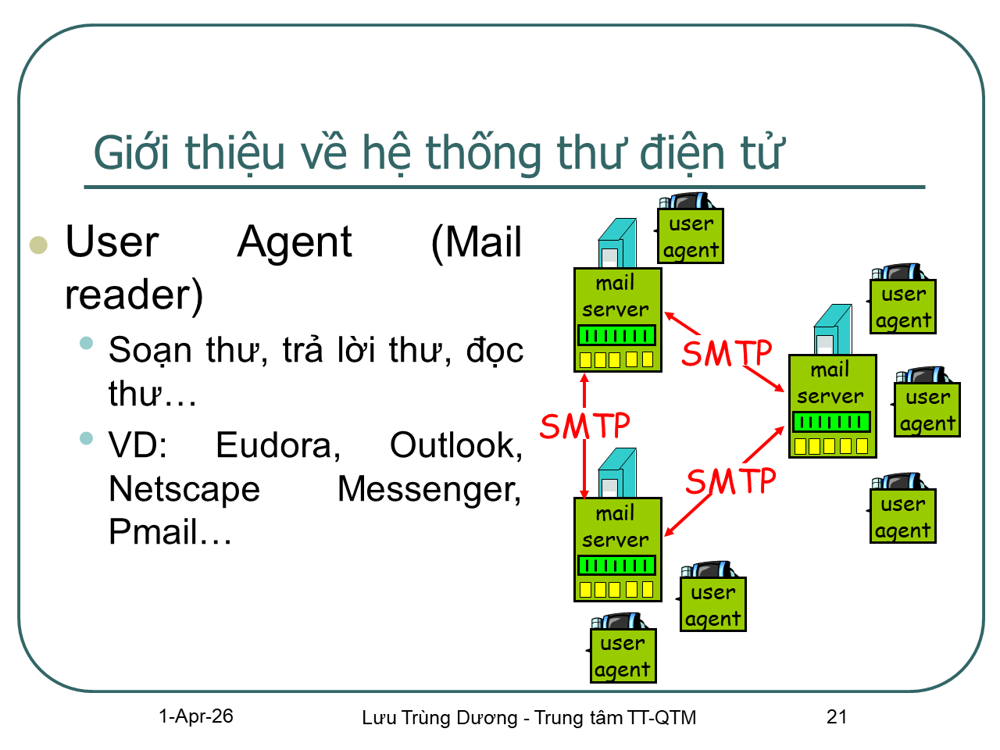

- Mail Servers
- Hộp thư (Mailbox) chứa thư gởi đến người sử dụng (thường là chưa đọc)
- Hàng đợi chứa các thư sẽ được gởi đi
- Trao đổi giữa các máy chủ mail:
- “Client”: máy chủ email thực hiện việc gởi thư
- “Server”: máy chủ email thực hiện việc nhận thư

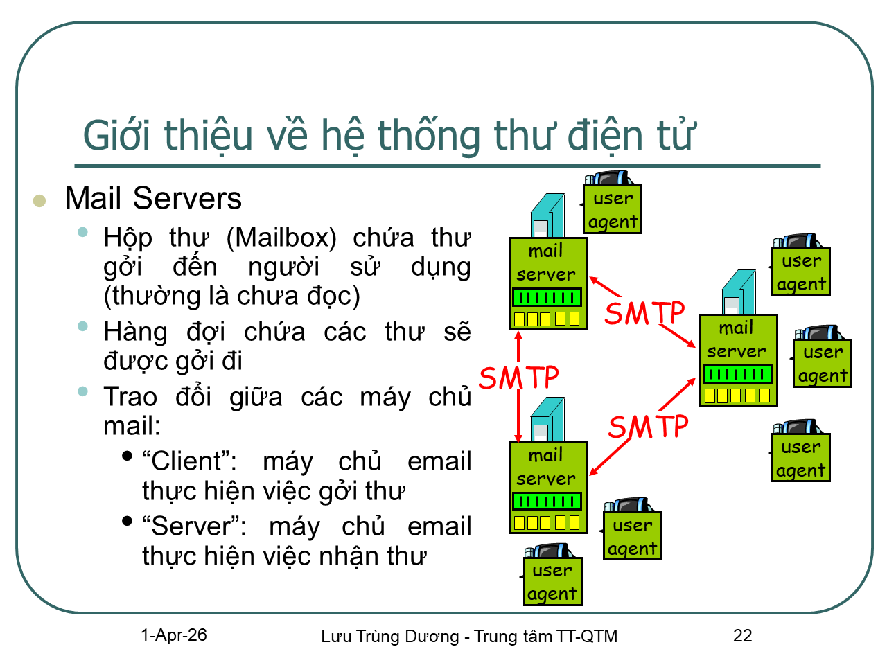

- Mail Protocols
- SMTP (Simple Mail Transfer Protocol) , RFC822
- POP3 (Post Office Protocol version 3 [RFC 1939])
- IMAP: (Internet Mail Access Protocol [RFC 1730]):
- SMTP: send
- POP3/IMAP
- Receive

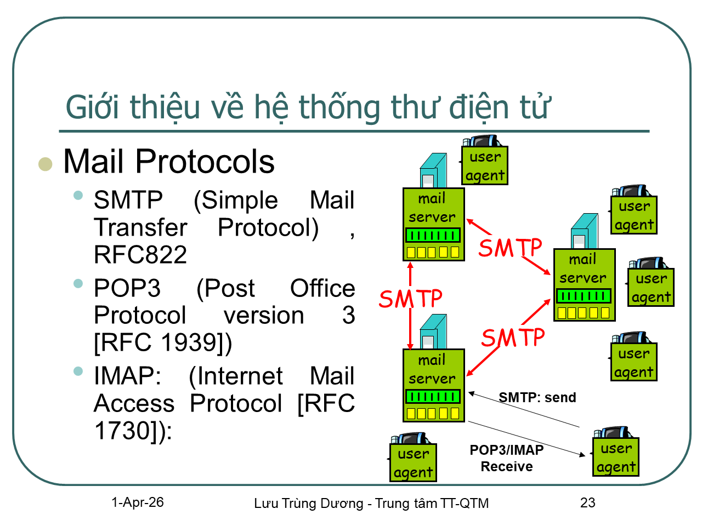

# Electronic Mail: SMTP [RFC 821]

- Sử dụng TCP để chuyển mail từ Client đến Server, port 25
- Chuyển mail trực tiếp: Sending Server to Receiving Server
- Chuyển tải qua 3 giai đoạn
- Handshaking (greeting): bắt tay
- Transfer of messages: truyền thư
- Closure: đóng kết nối
- Tương tác theo kiểu command/response
- Commands: ASCII text
- Response: status code and phrase
- Thông điệp phải mã hóa dưới dạng 7-bit ASCII

- S: 220 hamburger.edu
- C: HELO crepes.fr
- S: 250 Hello crepes.fr, pleased to meet you
- C: MAIL FROM: <alice@crepes.fr>
- S: 250 alice@crepes.fr... Sender ok
- C: RCPT TO: <bob@hamburger.edu>
- S: 250 bob@hamburger.edu ... Recipient ok
- C: DATA
- S: 354 Enter mail, end with "." on a line by itself
- C: Do you like ketchup?
- C: How about pickles?
- C: .
- S: 250 Message accepted for delivery
- C: QUIT
- S: 221 hamburger.edu closing connection

# Mail message format

- header
- blank
- line
- RFC 822: standard for text message format:
- header lines, e.g.,
- To:
- From:
- Subject:
- <CRLF>
- <CRLF>
- body
- the “message”, ASCII characters only
- body

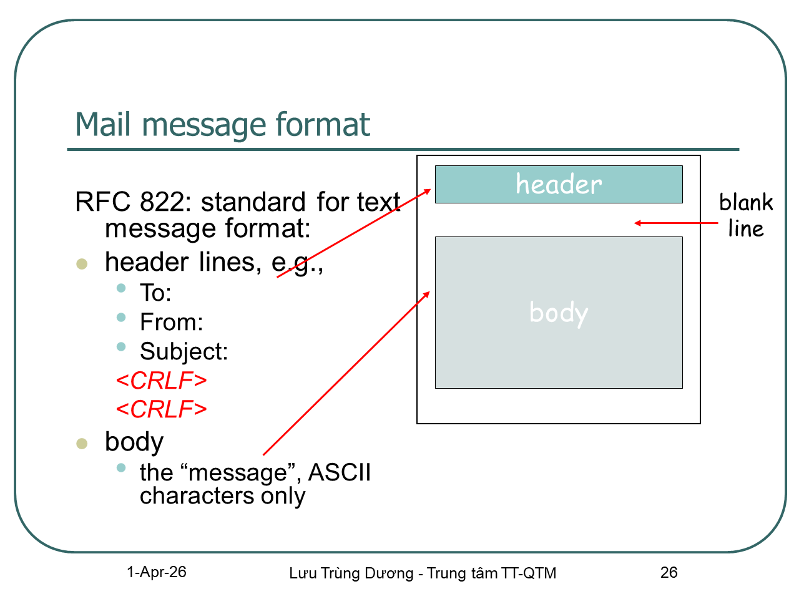

# MIME (Multipurpose Internet Mail Extensions)

- Cho phép email mang được nhiều loại dữ liệu: audio, video, hình ảnh, tài liệu Word, … RFC 2045, 2056
- Gồm 3 phần:
- Phần I: bổ túc cho phần header cũ của RFC 822 để mô tả dữ liệu chứa trong phần thân
- Phần II: Là các định nghĩa cho một tập các kiểu nội dung (và kiểu con nếu có).
- Phần III: mô tả cách thức mã hóa các kiểu dữ liệu

- MIME version
- method used
- to encode data
- multimedia data
- type, subtype,
- parameter declaration
- encoded data

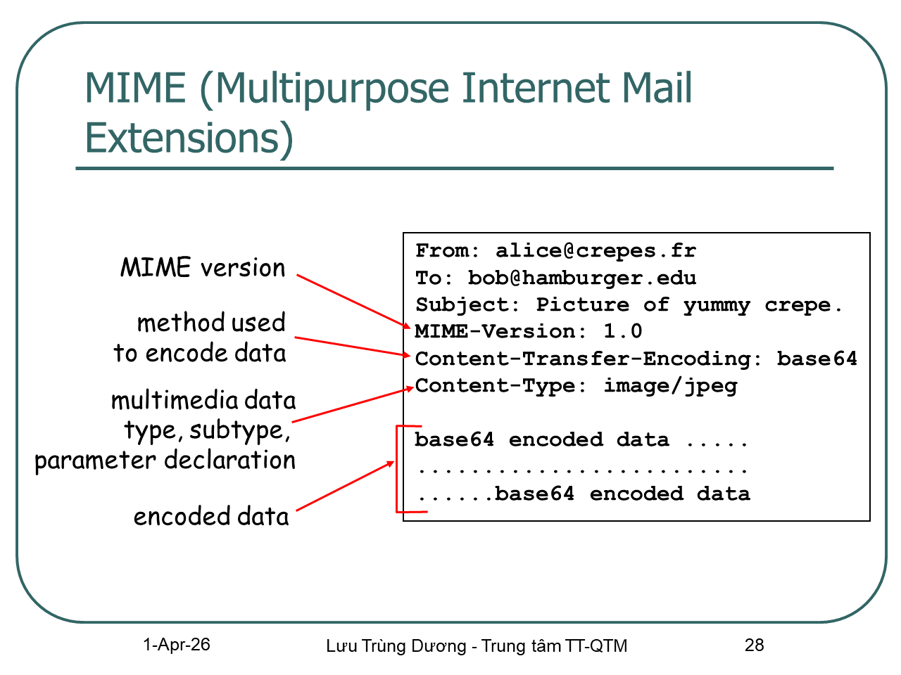

- Phần I: bổ túc cho phần header cũ của RFC 822 để mô tả dữ liệu chứa trong phần thân

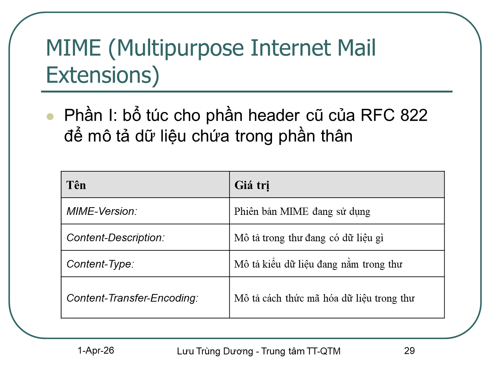

- Phần II: là các định nghĩa cho một tập các kiểu nội dung (và kiểu con nếu có)

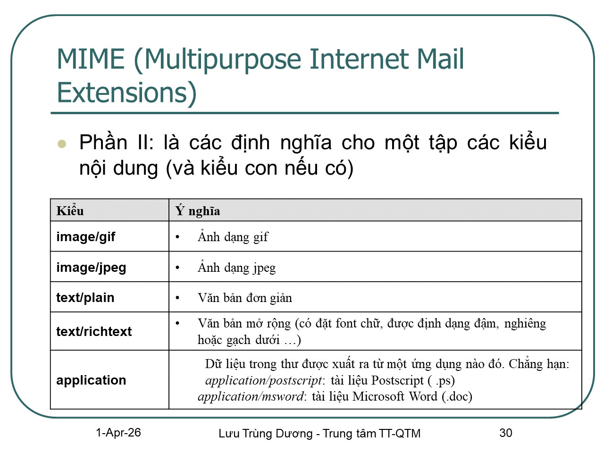

- Multipart - type
- From: alice@crepes.fr
- To: bob@hamburger.edu
- Subject: Picture of yummy crepe.
- MIME-Version: 1.0
- Content-Type: multipart/mixed; boundary=98766789
- --98766789
- Content-Transfer-Encoding: quoted-printable
- Content-Type: text/plain
- Dear Bob,
- Please find a picture of a crepe.
- --98766789
- Content-Transfer-Encoding: base64
- Content-Type: image/jpeg
- base64 encoded data .....
- .........................
- ......base64 encoded data
- --98766789--

- Phần III: mô tả cách thức mã hóa các kiểu dữ liệu thành dạng ASCII chuẩn.
- MIME sử dụng phương pháp mã hóa trực tiếp dữ liệu nhị phân thành các ký tự nhị phân, gọi là base64.
- Ánh xạ 3 bytes dữ liệu nhị phân nguyên thủy thành 4 ký tự ASCII
- 3 bytes (8bits) = 4 ký tự (6bits)
- Mã 0 ánh xạ thành A,
- 1 ánh xạ thành B, …
- Sau khi mã hoá chỉ có 52 chữ cái cả hoa lẫn thường, 10 chữ số từ 0 đến 9 và các ký tự đặc biệt + và /.

# Giao thức SMTP / 25

- S: 220 ctu.edu.vn
- C: HELO cit.ctu.edu.vn
- S: 250 ctu.edu.vn says hello to cit.ctu.edu.vn
- C: MAIL FROM: <ptphi@cit.ctu.edu.vn>
- S: 250 Sender ok
- C: RCPT TO: <lhly@yale.edu>
- S: 250 Recipient ok
- C: DATA
- S: 354 Enter mail, end with "." on a line by itself
- C: Subject: It’s Xmast!
- C: So I hope you a merry Xmas and a happy new year!
- C: .
- S: 250 Message accepted for delivery
- C: QUIT
- S: 221 Bye-Bye

# Giao thức POP3 / 110

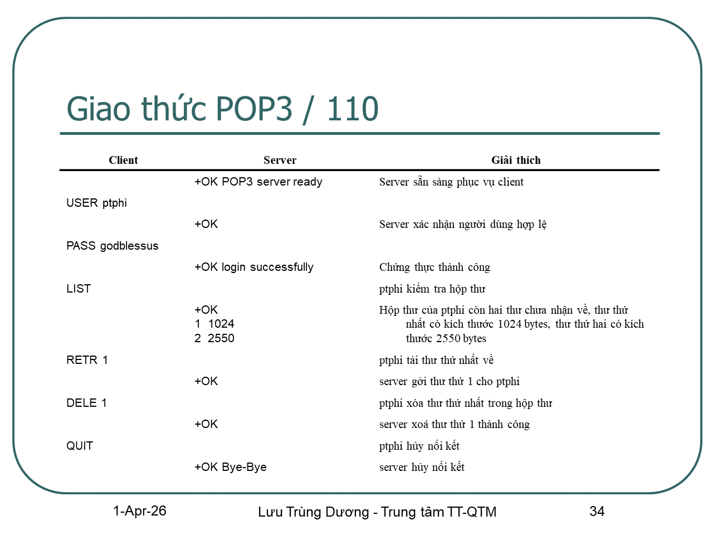

# Giao thức IMAP / 143

- POP3 thích hợp trong trường hợp người dùng thường xuyên truy xuất mail.
- POP 3 tải mail về máy cá nhân, mail nằm rãi rác nếu người dùng sử dụng nhiều máy tính khác nhau.
- IMAP (Internet Message Access Protocol), được định nghĩa trong RFC 2060: Người dùng không cần tải mail về máy tính cục bộ

# So sánh giữa POP3 và IMAP

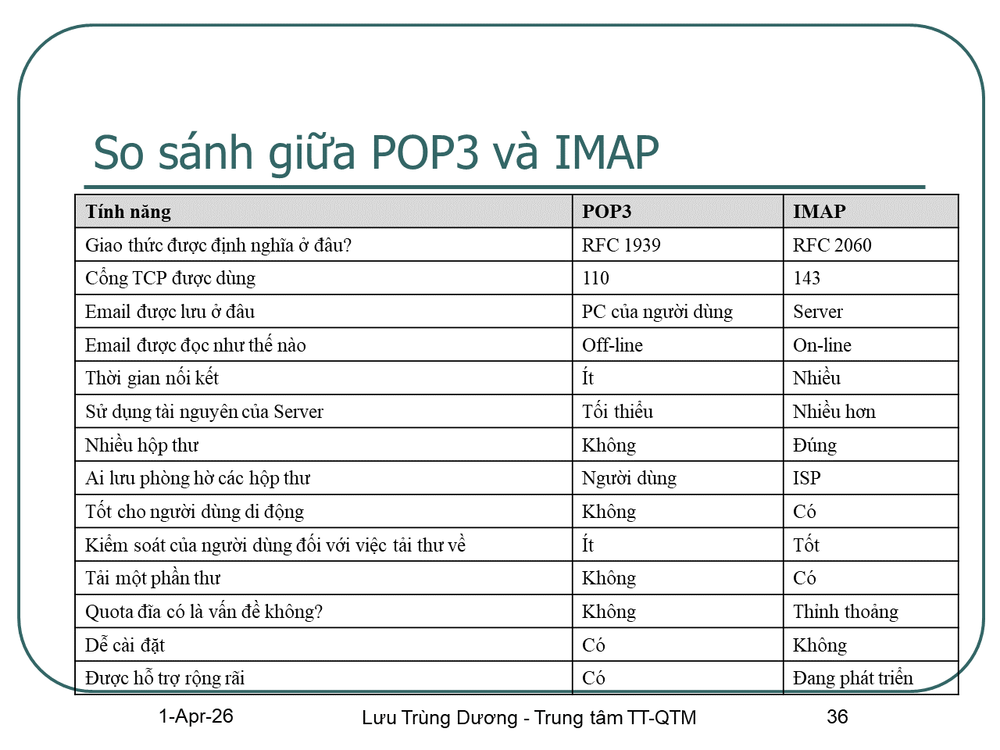

# Dịch vụ World Wide Web

- Được sử dụng phổ biến nhất trên Internet.
- Sử dụng giao thức HTTP: HyperText Transfer Protocol trên nên TCP
- Sử dụng mô hình client/server:
- Client: yêu cầu, nhận và hiển thi các trang Web
- Server: Gởi các trang Web cho client khi có yêu cầu.
- HTTP1.0: RFC 1945
- HTTP1.1: RFC 2068
- http request
- PC running
- Explorer
- http response
- http request
- Server
- running
- NCSA Web
- server
- http response
- Mac running
- Navigator

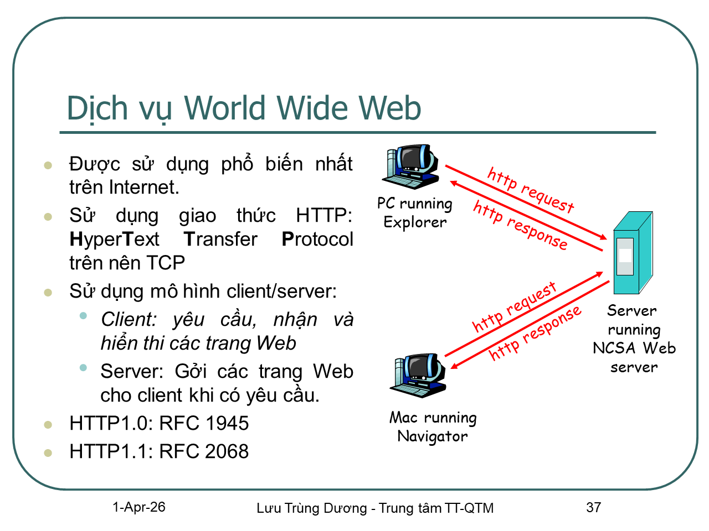

- HTTP: TCP transport service:
- Client: khởi tạo một nối kết TCP đến Server ở đang lắng nghe ở cổng 80
- Server chấp nhận nối kết TCP từ Client
- Thông điệp theo giao thức HTTP được trao đổi giữa client và server
- Nối kết TCP bị đóng lại
- HTTP là giao thức không trạng thái “stateless”
- Server không lưu giữ thông tin nào về các yêu cầu trong quá khứ của client

# Cấu trúc Request / HTTP

- request line
- (GET, POST,
- HEAD commands)
- GET /somedir/page.html HTTP/1.0
- User-agent: Mozilla/4.0
- Accept: text/html, image/gif,image/jpeg
- Accept-language:fr
- (extra carriage return, line feed)
- header
- lines
- Carriage return,
- line feed
- indicates end
- of message

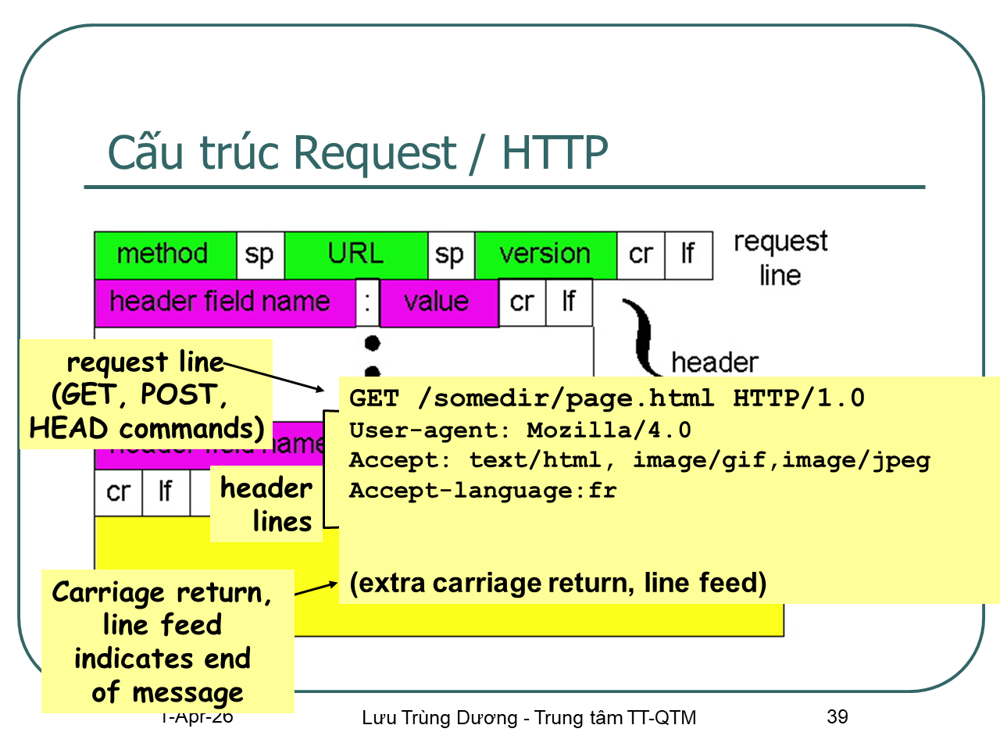

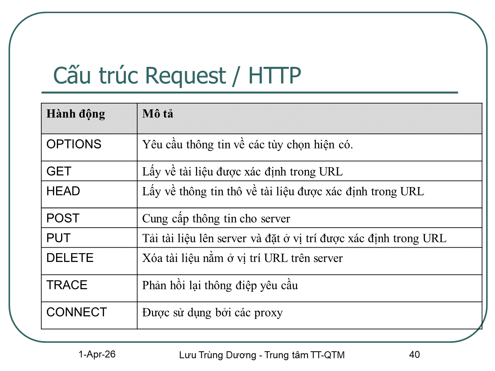

# Cấu trúc Response / HTTP

- status line
- (protocol
- status code
- status phrase)
- HTTP/1.0 200 OK
- Date: Thu, 06 Aug 1998 12:00:15 GMT
- Server: Apache/1.3.0 (Unix)
- Last-Modified: Mon, 22 Jun 1998 …...
- Content-Length: 6821
- Content-Type: text/html
- data data data data data ...
- header
- lines
- data, e.g.,
- requested
- html file

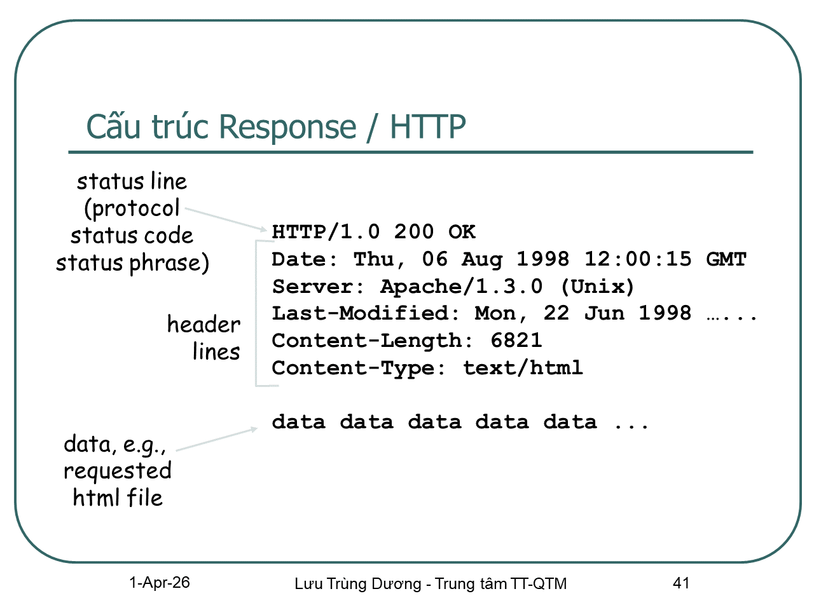

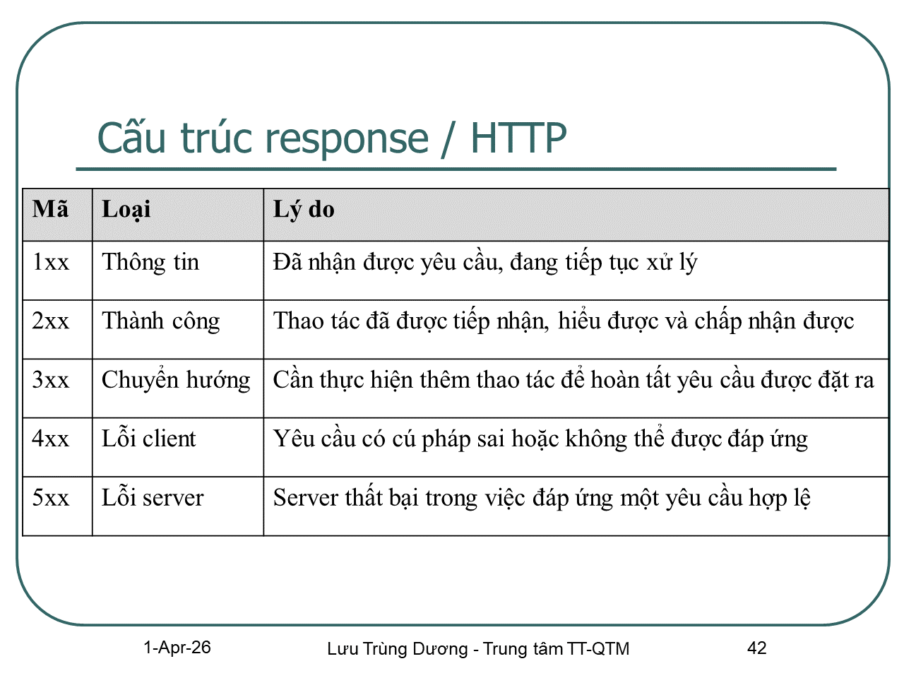

# Web Caches (proxy server)

- Đáp ứng yêu cầu khách hàng mà không cần truy cập đến server gốc
- Tiết kiệm băng thông
- origin
- server
- Proxy
- server
- Cache tại Browser / Proxy server
- Client gởi yêu cầu đến Web proxy:
- Nếu đối tượng có trong cache: proxy server sẽ trả về đối tượng.
- Ngược lại, proxy server yêu cầu đối tượng từ server gốc và gởi ngược về cho client
- http request
- http request
- client
- http response
- http response
- http request
- http response
- client

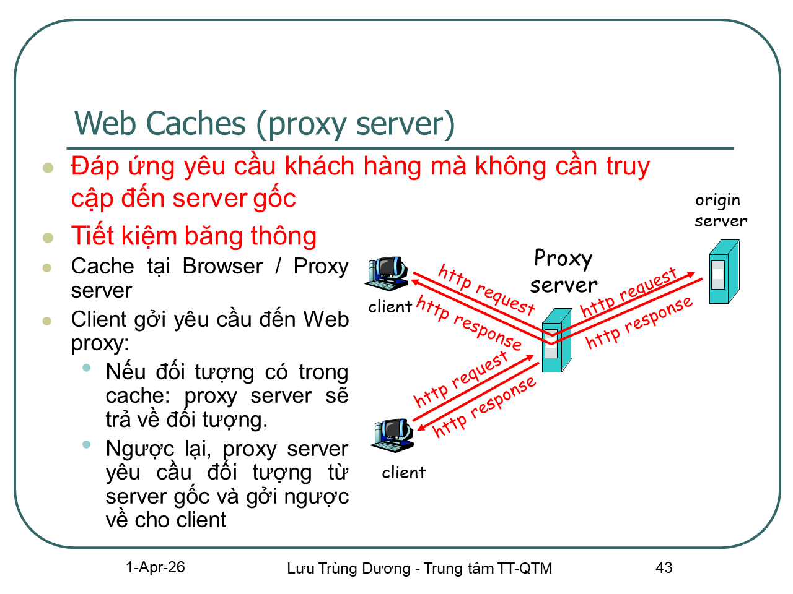

# FTP - File Transfer Protocol

- file transfer
- user
- at host
- remote file
- system
- Dịch vụ truyền tập tin giữa các máy tính ở xa nhau trên Internet.
- Hoạt động theo mô hình Client/Server
- Client: là bên khởi tạo quá trình truyền tập tin (từ hoặc tới Server)
- Server: Gởi tập tin cho Client/ Nhận tập tin từ Client
- FTP: RFC 959

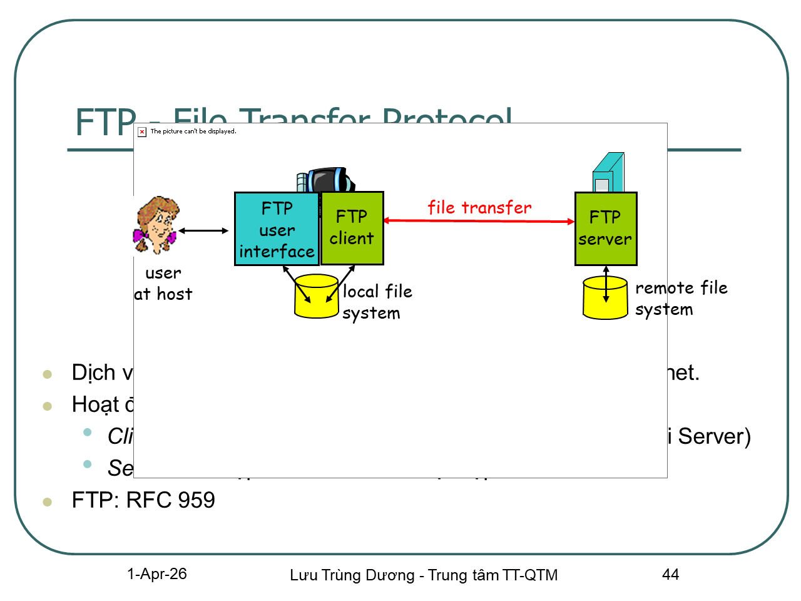

# FTP: separate control, data connections

- Client giao tiếp với Server tại cổng 21 / TCP
- Mở hai nối kết TCP:
- control: trao đổi lệnh và các trả lời giữa Client và Server.
- data: tập tin dữ liệu to/from Server
- FTP Server duy trì trạng thái về thư mục hiện hành và các chứng thực trước đó

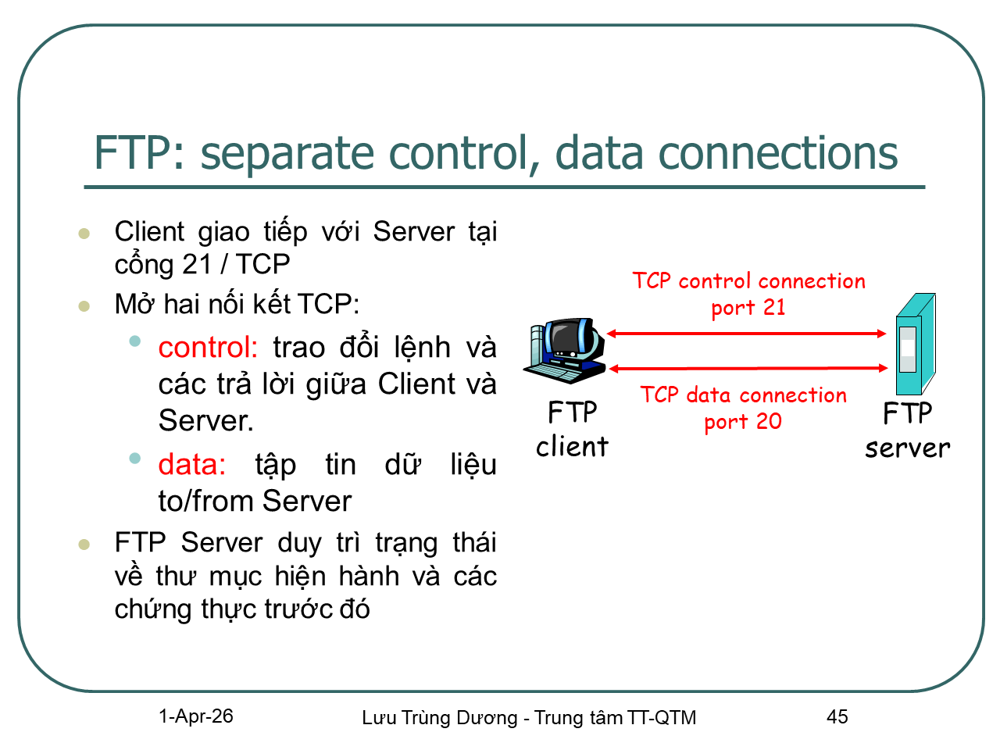

# Lệnh trong dịch vụ FTP

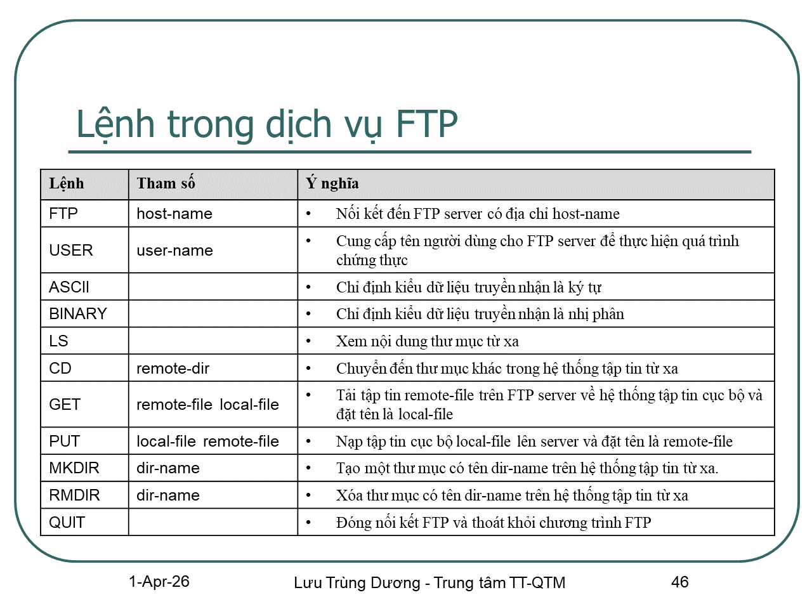
